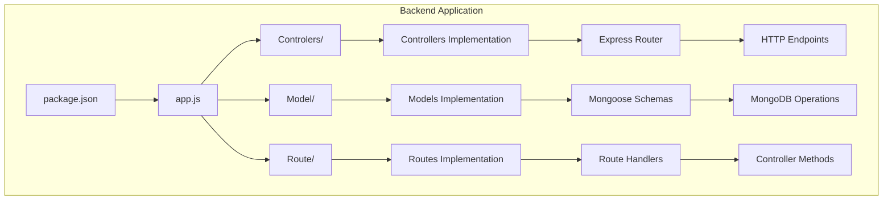
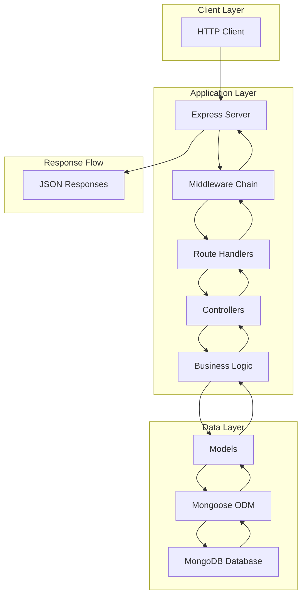
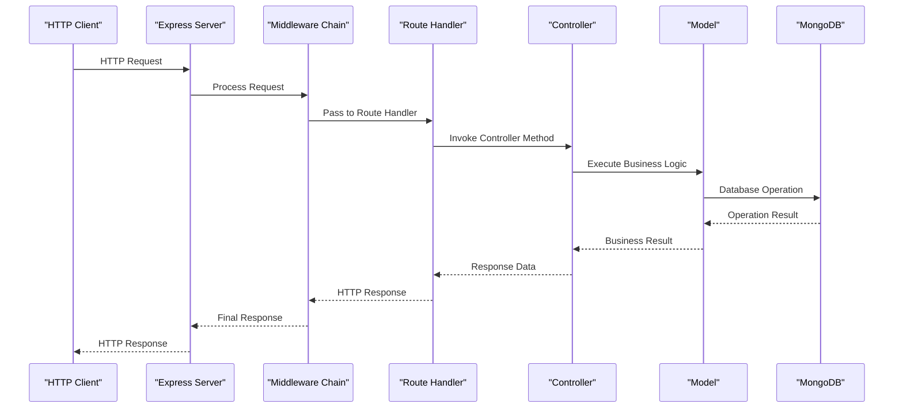
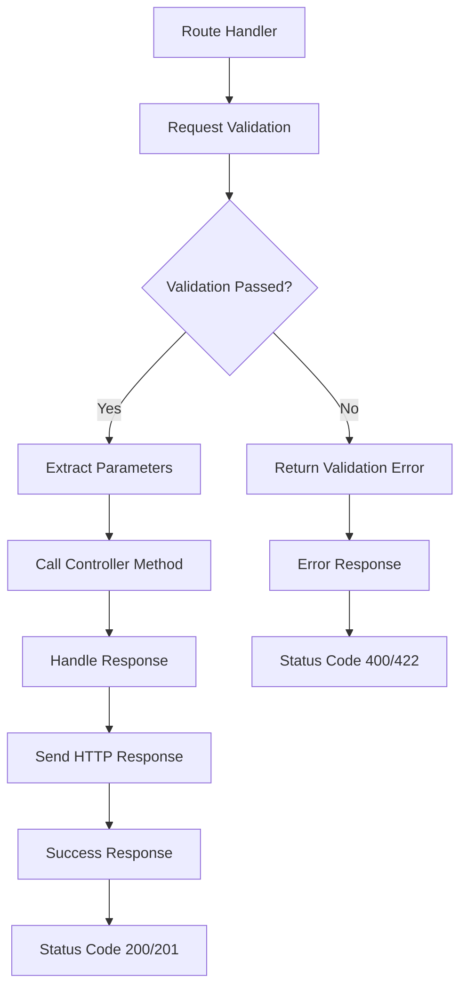
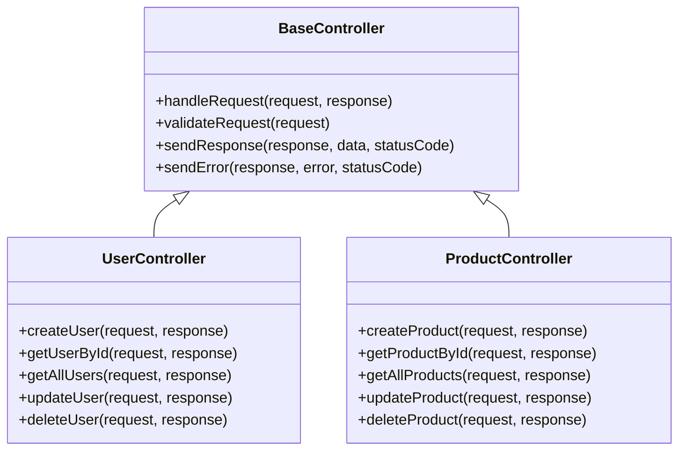
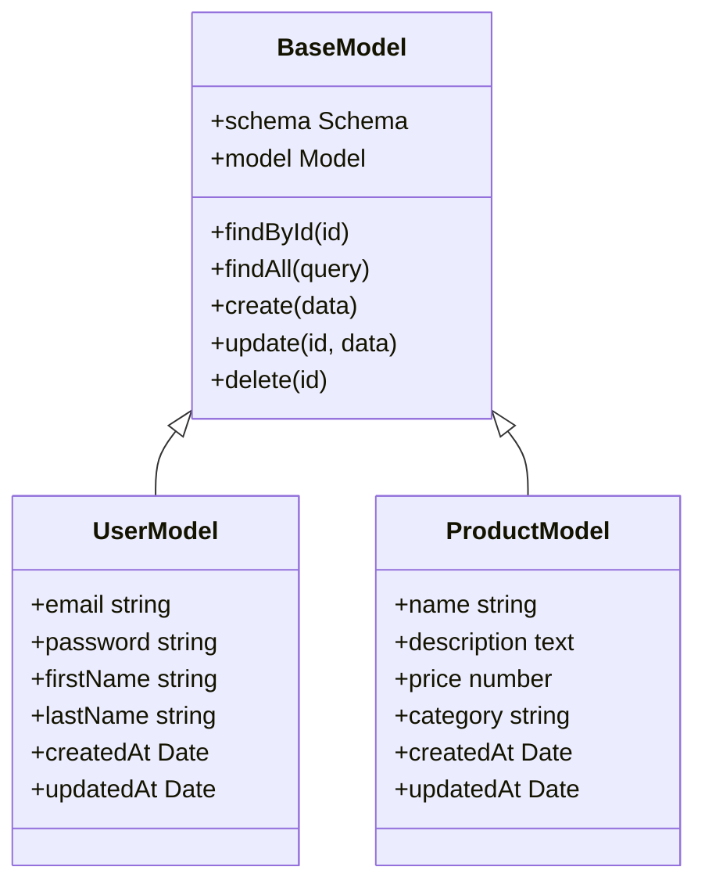
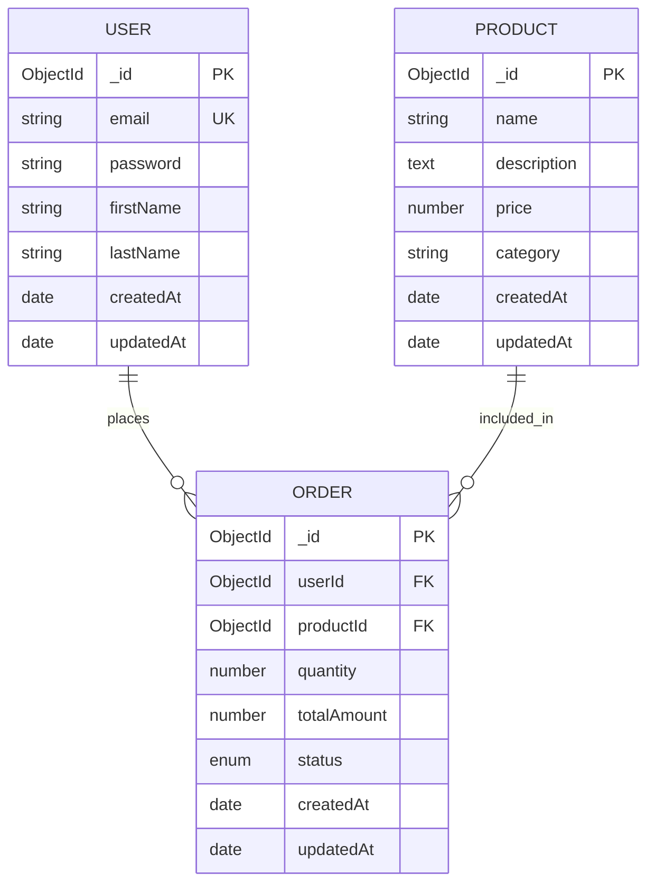
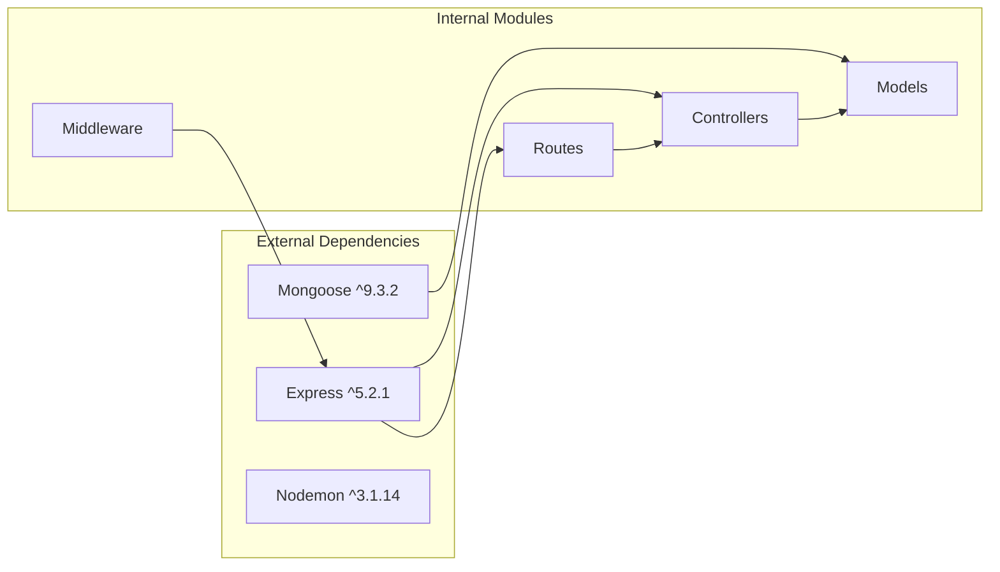

# Architecture Overview

<cite>
**Referenced Files in This Document**
- [package.json](file://Backend/package.json)
- [app.js](file://Backend/app.js)
</cite>

## Table of Contents
1. [Introduction](#introduction)
2. [Project Structure](#project-structure)
3. [Core Components](#core-components)
4. [Architecture Overview](#architecture-overview)
5. [Detailed Component Analysis](#detailed-component-analysis)
6. [Dependency Analysis](#dependency-analysis)
7. [Performance Considerations](#performance-considerations)
8. [Troubleshooting Guide](#troubleshooting-guide)
9. [Conclusion](#conclusion)

## Introduction
This document provides architectural documentation for ITPM_1's planned MVC (Model-View-Controller) architecture. The project is structured as a Node.js backend service using Express.js for HTTP routing and MongoDB via Mongoose for data persistence. The current repository snapshot shows a minimal skeleton with package.json and app.js, along with empty directories for future implementation of the MVC layers.

The architecture follows a layered approach where:
- Controllers handle HTTP requests and coordinate business logic
- Models represent data structures and database interactions
- Views render responses (in this case, JSON APIs)
- Middleware provides cross-cutting concerns like authentication and logging

## Project Structure
The project follows a conventional Node.js backend layout with planned MVC separation:

**Diagram sources**
- [package.json:1-19](file://Backend/package.json#L1-L19)
- [app.js:1-1](file://Backend/app.js#L1-L1)

The current structure shows:
- **Backend/**: Root directory containing all server-side code
- **package.json**: Dependencies and scripts configuration
- **app.js**: Entry point (currently minimal)
- **Controlers/**: Planned controllers directory
- **Model/**: Planned models directory  
- **Route/**: Planned routes directory

**Section sources**
- [package.json:1-19](file://Backend/package.json#L1-L19)
- [app.js:1-1](file://Backend/app.js#L1-L1)

## Core Components
The architecture is built around four primary components:

### Technology Stack
- **Express.js**: Web framework for HTTP routing and middleware
- **MongoDB**: NoSQL database for data storage
- **Mongoose**: ODM for MongoDB object modeling
- **Nodemon**: Development server for automatic restarts

### Design Patterns
- **MVC Pattern**: Separation of concerns across Model, View, and Controller layers
- **RESTful API**: HTTP-based interface design
- **Middleware Chain**: Request/response processing pipeline
- **Dependency Injection**: Modular service composition

### Component Responsibilities
- **Controllers**: Handle HTTP requests, validate input, orchestrate business logic
- **Models**: Define data structures, validation rules, and database operations
- **Views**: Render responses (JSON in this API-first design)
- **Routes**: Define URL patterns and HTTP method mappings

**Section sources**
- [package.json:13-17](file://Backend/package.json#L13-L17)

## Architecture Overview
The planned architecture implements a clean separation of concerns through the MVC pattern:

**Diagram sources**
- [package.json:13-17](file://Backend/package.json#L13-L17)

### Request Processing Flow
1. **Incoming Request**: HTTP client sends request to Express server
2. **Middleware Execution**: Pre-processing pipeline handles authentication, logging, etc.
3. **Route Matching**: URL pattern matched to appropriate route handler
4. **Controller Invocation**: Route handler calls controller method
5. **Business Logic**: Controller executes application-specific logic
6. **Data Access**: Model layer performs database operations
7. **Response Generation**: JSON response returned to client

### Data Flow Patterns
- **Request Flow**: HTTP → Middleware → Routes → Controllers → Models → Database
- **Response Flow**: Database → Models → Controllers → Routes → Middleware → HTTP Response
- **Error Flow**: Propagation through middleware chain with centralized error handling

## Detailed Component Analysis

### Express.js Server Setup
The Express server serves as the central HTTP processing engine:

**Diagram sources**
- [package.json:13-17](file://Backend/package.json#L13-L17)

### Route Handler Architecture
Route handlers act as entry points for specific API endpoints:

**Diagram sources**
- [package.json:13-17](file://Backend/package.json#L13-L17)

### Controller Layer Implementation
Controllers coordinate between routes and models:

**Diagram sources**
- [package.json:13-17](file://Backend/package.json#L13-L17)

### Model Layer Architecture
Models define data structures and database operations:

**Diagram sources**
- [package.json:13-17](file://Backend/package.json#L13-L17)

### Database Integration with Mongoose
Mongoose provides ODM capabilities for MongoDB:

**Diagram sources**
- [package.json:13-17](file://Backend/package.json#L13-L17)

## Dependency Analysis
The project maintains loose coupling through dependency injection and modular design:

**Diagram sources**
- [package.json:13-17](file://Backend/package.json#L13-L17)

### Dependency Relationships
- **Express** provides HTTP routing and middleware infrastructure
- **Mongoose** enables database abstraction and schema validation
- **Controllers** depend on Models for data operations
- **Routes** depend on Controllers for business logic
- **Middleware** provides cross-cutting concerns across all layers

### Circular Dependency Prevention
The architecture prevents circular dependencies through:
- Clear directional data flow (Routes → Controllers → Models)
- Shared interfaces between layers
- Dependency inversion principle
- Modular file organization

**Section sources**
- [package.json:13-17](file://Backend/package.json#L13-L17)

## Performance Considerations
Several architectural decisions impact performance:

### Request Processing Pipeline
- **Middleware Order**: Critical for performance optimization
- **Database Connection Pooling**: Configured through Mongoose
- **Response Caching**: Potential for read-heavy operations
- **Error Handling**: Efficient error propagation reduces overhead

### Scalability Factors
- **Horizontal Scaling**: Stateless controllers enable load balancing
- **Database Indexing**: Proper indexing on frequently queried fields
- **Connection Management**: Optimized MongoDB connection pooling
- **Memory Management**: Efficient model instantiation and cleanup

### Optimization Opportunities
- **Caching Strategy**: Implement Redis for frequently accessed data
- **Database Queries**: Optimize aggregation pipelines for complex operations
- **Response Compression**: Enable gzip compression for large payloads
- **Rate Limiting**: Implement middleware for traffic control

## Troubleshooting Guide
Common issues and their solutions:

### Server Startup Issues
- **Port Conflicts**: Verify port availability before server startup
- **Environment Variables**: Ensure database connection strings are configured
- **Module Dependencies**: Check for missing or incompatible packages

### Database Connection Problems
- **Connection String Format**: Validate MongoDB URI format
- **Network Connectivity**: Test database server accessibility
- **Authentication**: Verify credentials and database permissions

### Request Processing Errors
- **Route Matching**: Debug URL patterns and HTTP method configurations
- **Middleware Chain**: Identify failing middleware in the pipeline
- **Controller Logic**: Validate input parameters and business rules

### Performance Issues
- **Memory Leaks**: Monitor memory usage and garbage collection
- **Database Queries**: Analyze slow query performance
- **Response Times**: Profile request processing bottlenecks

## Conclusion
The ITPM_1 architecture demonstrates a well-structured MVC approach tailored for modern web applications. The planned implementation provides:

- **Clear Separation of Concerns**: Distinct layers for controllers, models, and views
- **Scalable Foundation**: Modular design enabling easy feature expansion
- **Robust Data Access**: Mongoose provides type-safe database operations
- **Flexible Routing**: Express.js enables RESTful API design
- **Development Efficiency**: Nodemon and proper project structure support rapid development

The architecture balances flexibility with maintainability, providing a solid foundation for future feature development while maintaining performance and scalability considerations. The planned implementation aligns with industry best practices for Node.js backend development.