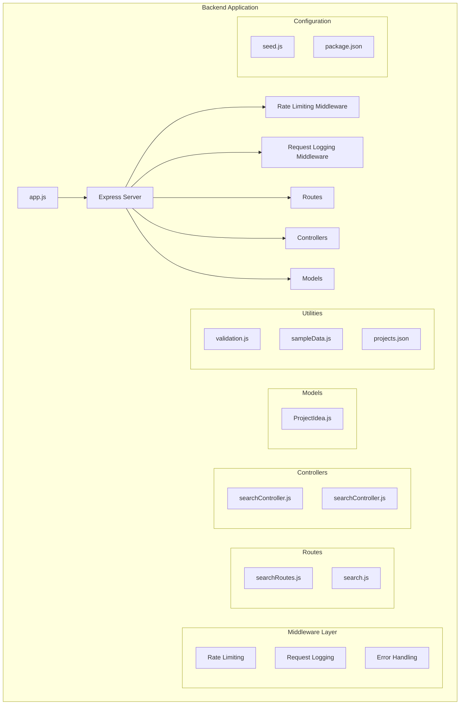
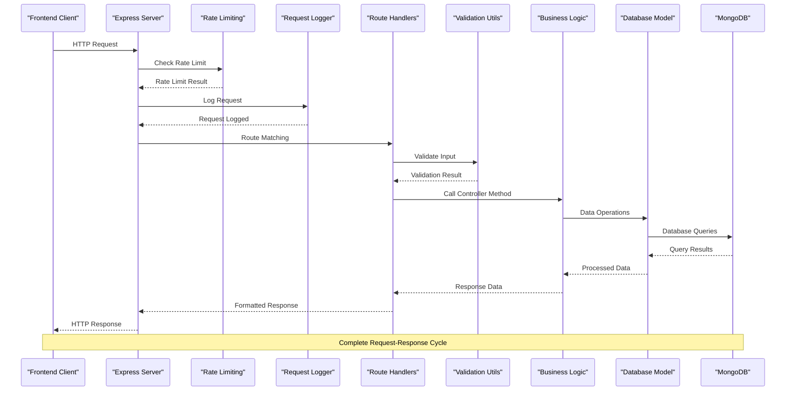
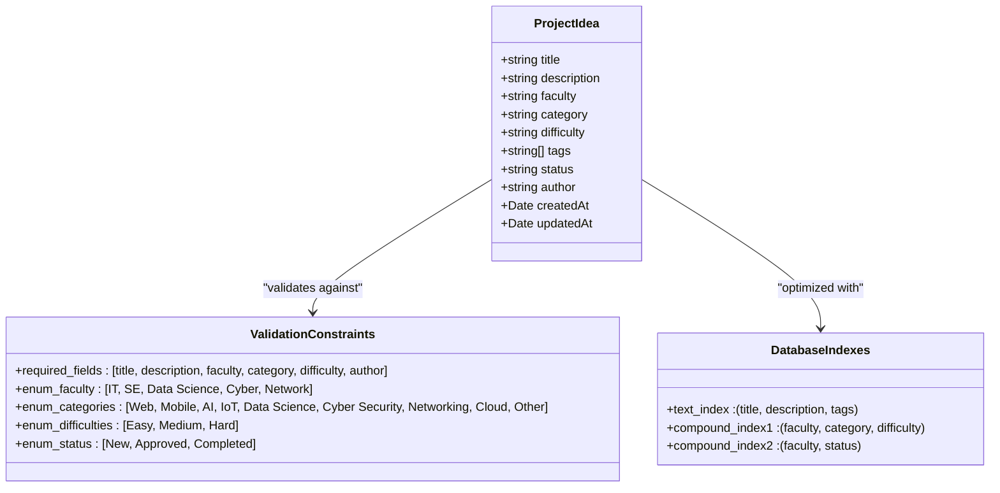
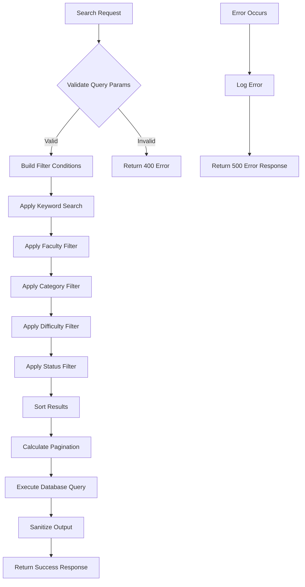
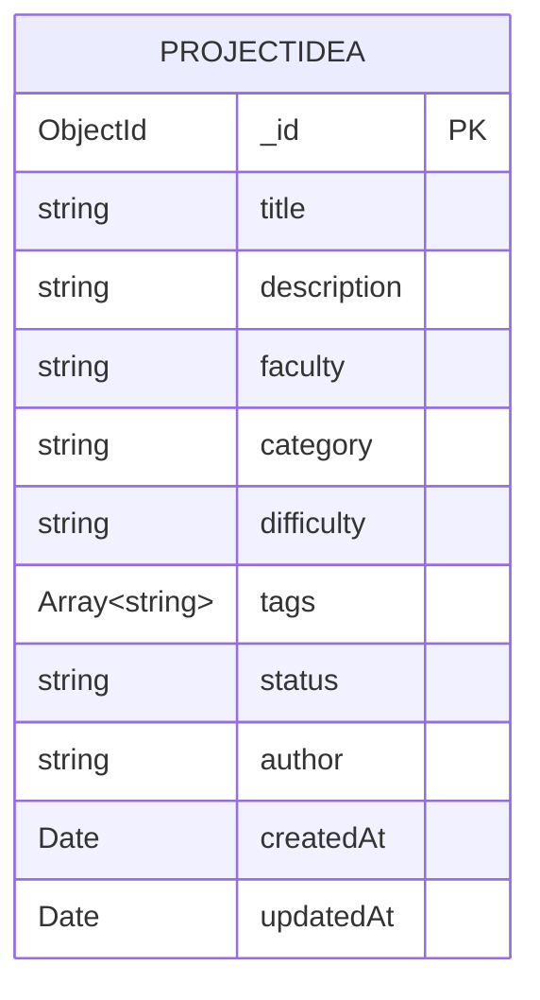
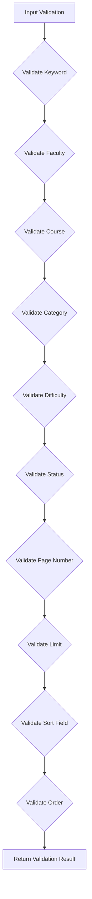
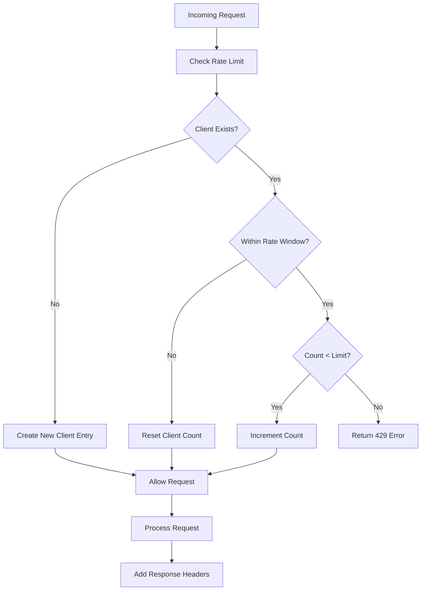

# Backend API Documentation

<cite>
**Referenced Files in This Document**
- [app.js](file://Backend/app.js)
- [package.json](file://Backend/package.json)
- [searchRoutes.js](file://Backend/Route/searchRoutes.js)
- [searchController.js](file://Backend/Controlers/searchController.js)
- [searchController.js](file://Backend/controller/searchController.js)
- [validation.js](file://Backend/utils/validation.js)
- [projects.json](file://Backend/config/projects.json)
- [sampleData.js](file://Backend/data/sampleData.js)
- [seed.js](file://Backend/seed.js)
- [search.js](file://Backend/routes/search.js)
</cite>

## Update Summary
**Changes Made**
- Updated to reflect the new unified search functionality under `/api/search` endpoints
- Added comprehensive search parameters documentation including keyword, faculty, course, category, difficulty, status, sortBy, order, page, and limit
- Enhanced filter options documentation with dynamic filter retrieval and counts
- Updated tag management documentation with comprehensive tag aggregation
- Improved API response format documentation with standardized error handling
- Added detailed validation rules and security features
- Updated rate limiting implementation with configurable limits

## Table of Contents
1. [Introduction](#introduction)
2. [Project Structure](#project-structure)
3. [Core Components](#core-components)
4. [Architecture Overview](#architecture-overview)
5. [Detailed Component Analysis](#detailed-component-analysis)
6. [API Endpoints](#api-endpoints)
7. [Database Schema](#database-schema)
8. [Search and Filtering](#search-and-filtering)
9. [Validation and Security](#validation-and-security)
10. [Rate Limiting](#rate-limiting)
11. [Development Setup](#development-setup)
12. [Troubleshooting Guide](#troubleshooting-guide)
13. [Conclusion](#conclusion)

## Introduction

The ITPM Project Backend is a comprehensive RESTful API built with Node.js, Express, and MongoDB that provides project management functionality with advanced search and filtering capabilities. This system serves as the backend foundation for an academic project ideas platform, offering features for project discovery, filtering, and management.

The API supports multiple search strategies including keyword search across multiple fields, faceted filtering by faculty, course, category, difficulty, and status, along with intelligent search suggestions and comprehensive filter option retrieval. The system now includes robust security measures, rate limiting, and comprehensive validation to ensure reliable operation.

**Updated** The current implementation uses an in-memory data store for demonstration purposes, with comprehensive sample data containing 33 project ideas across multiple faculties (IT, SE, Data Science, Cyber, Network). The unified search endpoint structure under `/api/search` provides comprehensive filtering and pagination capabilities with enhanced validation and security features.

## Project Structure

The backend follows a modular architecture organized by concerns with enhanced middleware and validation layers:



**Diagram sources**
- [app.js:1-82](file://Backend/app.js#L1-L82)
- [searchRoutes.js:1-35](file://Backend/Route/searchRoutes.js#L1-L35)
- [ProjectIdea.js:1-71](file://Backend/Model/ProjectIdea.js#L1-L71)
- [validation.js:1-344](file://Backend/utils/validation.js#L1-L344)

**Section sources**
- [app.js:1-82](file://Backend/app.js#L1-L82)
- [package.json:1-20](file://Backend/package.json#L1-L20)

## Core Components

### Express Server Configuration

The application initializes with enhanced middleware stack and database connectivity:

- **CORS Support**: Enables cross-origin resource sharing for frontend integration
- **JSON Processing**: Handles JSON request/response bodies with increased size limits
- **Rate Limiting Middleware**: Prevents API abuse with configurable request limits
- **Request Logging**: Logs all incoming requests for debugging and monitoring
- **Route Registration**: Mounts search endpoints at `/api/search`
- **Health Check**: Provides `/api/health` endpoint for monitoring
- **Root Endpoint**: Documents available API endpoints
- **Global Error Handling**: Centralized error processing with detailed logging

### Database Integration

The system uses MongoDB with Mongoose ODM for data persistence:

- **Connection Management**: Graceful fallback when database is unavailable
- **Schema Validation**: Comprehensive field validation and constraints
- **Index Optimization**: Text indexes for search performance and compound indexes for filtering
- **Seed Data**: Sample data for demonstration and testing
- **Model Implementation**: Full-featured ProjectIdea model with proper validation

**Updated** Alternative implementation using in-memory data store with comprehensive sample data for demonstration purposes containing 33 project ideas across multiple faculties.

### Enhanced Error Handling

Robust error handling mechanisms with improved error responses:
- **404 Not Found**: Global route handler for undefined endpoints
- **500 Internal Server Error**: Centralized error processing with detailed error messages
- **429 Too Many Requests**: Rate limiting error responses
- **400 Bad Request**: Validation error responses
- **Development vs Production**: Different error message handling based on environment
- **Request Logging**: Comprehensive logging for debugging and monitoring

**Section sources**
- [app.js:13-82](file://Backend/app.js#L13-L82)
- [ProjectIdea.js:1-71](file://Backend/Model/ProjectIdea.js#L1-L71)

## Architecture Overview

The backend follows a layered architecture pattern with enhanced middleware and validation layers:



**Diagram sources**
- [app.js:13-35](file://Backend/app.js#L13-L35)
- [searchRoutes.js:22](file://Backend/Route/searchRoutes.js#L22)
- [validation.js:22-142](file://Backend/utils/validation.js#L22-L142)
- [searchController.js:23-133](file://Backend/Controlers/searchController.js#L23-L133)

## Detailed Component Analysis

### ProjectIdea Model Analysis

The ProjectIdea model defines the core data structure with comprehensive validation and optimization:



**Diagram sources**
- [ProjectIdea.js:3-55](file://Backend/Model/ProjectIdea.js#L3-L55)
- [ProjectIdea.js:57-66](file://Backend/Model/ProjectIdea.js#L57-L66)

Key validation features:
- **Required Fields**: Ensures essential project information is always present
- **Enum Constraints**: Restricts values to predefined categories and classifications
- **Text Indexing**: Optimizes search performance across title, description, and tags
- **Compound Indexes**: Optimizes filtering by common field combinations
- **Default Values**: Status defaults to 'New' for new projects

**Section sources**
- [ProjectIdea.js:1-71](file://Backend/Model/ProjectIdea.js#L1-L71)

### Route Layer Analysis

The routing system provides a unified endpoint structure under `/api/search` with comprehensive documentation:

```mermaid
graph LR
subgraph "Unified Routes (/api/search)"
A[/api/search] --> B[GET: Search Projects]
C[/api/search/filters] --> D[GET: Filter Options]
E[/api/search/tags] --> F[GET: All Tags]
end
subgraph "Legacy Routes"
G[/api/projects/search] --> H[Deprecated]
I[/api/projects/filters] --> J[Deprecated]
K[/api/projects/suggestions] --> L[Deprecated]
end
```

**Diagram sources**
- [searchRoutes.js:9-32](file://Backend/Route/searchRoutes.js#L9-L32)

**Section sources**
- [searchRoutes.js:1-35](file://Backend/Route/searchRoutes.js#L1-L35)

### Controller Layer Analysis

The controller layer implements business logic with comprehensive error handling and input validation:



**Diagram sources**
- [searchController.js:23-133](file://Backend/Controlers/searchController.js#L23-L133)

**Section sources**
- [searchController.js:1-245](file://Backend/Controlers/searchController.js#L1-L245)

## API Endpoints

### Unified Search Endpoints

| Method | Endpoint | Query Parameters | Description |
|--------|----------|------------------|-------------|
| GET | `/api/search` | `keyword`, `faculty`, `course`, `category`, `difficulty`, `status`, `sortBy`, `order`, `page`, `limit` | Advanced search with comprehensive filtering and pagination |
| GET | `/api/search/filters` | None | Get available filter options with counts |
| GET | `/api/search/tags` | None | Get all unique tags |
| GET | `/api/health` | None | Health check endpoint for monitoring |

### Legacy Endpoints

| Method | Endpoint | Description |
|--------|----------|-------------|
| GET | `/api/projects/search` | Legacy search endpoint (deprecated) |
| GET | `/api/projects/filters` | Legacy filters endpoint (deprecated) |
| GET | `/api/projects/suggestions` | Legacy suggestions endpoint (deprecated) |

### Response Format

Standardized response structure:
```javascript
{
  success: boolean,
  message?: string,
  data: any,
  count?: number,
  total?: number,
  totalPages?: number,
  currentPage?: number,
  pagination?: {
    currentPage: number,
    totalPages: number,
    totalCount: number,
    hasNextPage: boolean,
    hasPrevPage: boolean,
    limit: number
  },
  filters?: object,
  errors?: string[]
}
```

**Section sources**
- [searchRoutes.js:9-32](file://Backend/Route/searchRoutes.js#L9-L32)

## Database Schema

### ProjectIdea Collection Structure

The database schema enforces strict data integrity with comprehensive validation:



**Diagram sources**
- [ProjectIdea.js:3-55](file://Backend/Model/ProjectIdea.js#L3-L55)

### Index Configuration

Optimization indexes:
- **Text Index**: (`title`: 'text', `description`: 'text', `tags`: 'text')
- **Compound Index**: (`faculty`: 1, `category`: 1, `difficulty`: 1)
- **Compound Index**: (`faculty`: 1, `status`: 1)

**Section sources**
- [ProjectIdea.js:57-66](file://Backend/Model/ProjectIdea.js#L57-L66)

## Search and Filtering

### Search Algorithm

The search functionality implements a multi-layered approach with enhanced validation:

1. **Input Validation**: Comprehensive parameter validation with sanitization
2. **Keyword Search**: Case-insensitive substring matching across title, description, and tags
3. **Faceted Filtering**: Multi-dimensional filtering by faculty, course, category, difficulty, and status
4. **Advanced Sorting**: Flexible sorting by multiple fields with ascending/descending order
5. **Pagination**: Configurable page size with comprehensive pagination metadata
6. **Output Sanitization**: XSS prevention for all response data

**Updated** The current implementation uses an in-memory data store with comprehensive sample data containing 33 project ideas across multiple faculties (IT, SE, Data Science, Cyber, Network).

### Filter Options

Dynamic filter retrieval provides:
- Unique values for each categorical field
- Count statistics for each filter option
- Real-time filter availability
- Comprehensive validation of filter values

### Tag Management

Comprehensive tag handling:
- Aggregation of all unique tags from projects
- Sorting and deduplication
- Support for tag-based filtering
- Tag validation and sanitization

**Section sources**
- [searchController.js:19-245](file://Backend/Controlers/searchController.js#L19-L245)

## Validation and Security

### Input Validation System

The validation system provides comprehensive parameter validation:



**Diagram sources**
- [validation.js:22-142](file://Backend/utils/validation.js#L22-L142)

### Security Features

- **XSS Prevention**: Input sanitization for all string inputs
- **Parameter Validation**: Comprehensive validation of all query parameters
- **Rate Limiting**: Configurable request limits per IP address
- **Input Sanitization**: Removal of potentially harmful characters
- **Output Sanitization**: Protection against reflected XSS in responses

### Validation Rules

- **Keyword**: Max 100 characters, sanitized for security
- **Faculty**: Must be one of: IT, SE, Data Science, Cyber, Network
- **Course**: Must be one of the comprehensive course list
- **Category**: Must be one of: Web, Mobile, AI, IoT, Data Science, Cyber Security, Networking, Cloud, Other
- **Difficulty**: Must be one of: Easy, Medium, Hard
- **Status**: Must be one of: New, Approved, Completed
- **Page**: Min 1, Max 1000, Default 1
- **Limit**: Min 1, Max 100, Default 10
- **Sort Fields**: title, createdAt, difficulty, faculty, category
- **Sort Order**: asc, desc

**Section sources**
- [validation.js:17-142](file://Backend/utils/validation.js#L17-L142)

## Rate Limiting

### Rate Limiting Implementation

The system implements rate limiting to prevent API abuse:



**Diagram sources**
- [validation.js:262-292](file://Backend/utils/validation.js#L262-L292)

### Rate Limit Configuration

- **Default Limit**: 100 requests per minute per IP address
- **Rate Window**: 60 seconds
- **Response Headers**: X-RateLimit-Limit, X-RateLimit-Remaining
- **Error Response**: 429 Too Many Requests with retry-after information
- **Memory Storage**: In-memory request counting (can be replaced with Redis)

### Rate Limit Response Headers

- **X-RateLimit-Limit**: Maximum requests allowed in the current window
- **X-RateLimit-Remaining**: Number of requests remaining in the current window
- **Retry-After**: Time in seconds until the rate limit resets

**Section sources**
- [app.js:13-29](file://Backend/app.js#L13-L29)
- [validation.js:255-292](file://Backend/utils/validation.js#L255-L292)

## Development Setup

### Prerequisites

- Node.js 14+ LTS
- MongoDB 4.4+ (for full functionality)
- npm 6+

### Installation Steps

1. **Backend Setup**:
   ```bash
   cd Backend
   npm install
   ```

2. **Database Seeding** (Optional):
   ```bash
   node seed.js
   ```

3. **Environment Configuration**:
   - Set `MONGODB_URI` environment variable for MongoDB integration
   - Configure CORS settings in production
   - Set up rate limiting configuration if needed

4. **Start Development Server**:
   ```bash
   npm run dev
   ```

### Available Scripts

| Script | Command | Description |
|--------|---------|-------------|
| start | `node app.js` | Production mode |
| dev | `nodemon app.js` | Development with auto-reload |
| test | `echo "Error: no test specified"` | Placeholder for future testing |

### Environment Variables

- `MONGODB_URI`: MongoDB connection string (optional, falls back to in-memory data)
- `PORT`: Server port (default: 5002)

**Section sources**
- [package.json:6-10](file://Backend/package.json#L6-L10)
- [seed.js:4](file://Backend/seed.js#L4)

## Troubleshooting Guide

### Common Issues

1. **Database Connection Problems**:
   - Verify MongoDB service is running
   - Check connection URI format
   - Review network connectivity
   - Fallback to in-memory data if MongoDB unavailable

2. **Rate Limiting Issues**:
   - Check X-RateLimit headers for current limits
   - Wait for rate limit window to reset
   - Adjust client-side request frequency
   - Consider upgrading rate limit configuration

3. **API Response Issues**:
   - Validate request payload structure
   - Check query parameter formatting
   - Review error logs for detailed messages
   - Verify input validation rules

4. **Search Performance**:
   - Ensure proper indexing is in place
   - Optimize query parameters
   - Monitor database query execution plans
   - Consider MongoDB deployment for production

### Debugging Tips

- Enable development logging for detailed error traces
- Use curl or Postman for direct API testing
- Monitor rate limit headers for debugging
- Validate input parameters against validation rules
- Check request logging for troubleshooting

**Section sources**
- [app.js:58-74](file://Backend/app.js#L58-L74)
- [searchController.js:125-132](file://Backend/Controlers/searchController.js#L125-L132)

## Conclusion

The ITPM Project Backend provides a robust, scalable foundation for academic project management with advanced search capabilities and comprehensive security features. The enhanced system offers improved reliability, security, and developer experience through:

### Key Enhancements

- **Enhanced Security**: Comprehensive input validation, XSS prevention, and rate limiting
- **Improved Reliability**: Better error handling, logging, and monitoring capabilities
- **Advanced Search**: Multi-field, multi-criteria search with intelligent suggestions
- **MongoDB Integration**: Full-featured database with proper schema validation and indexing
- **Performance Optimization**: Strategic indexing, pagination, and rate limiting
- **Developer Experience**: Clear API structure with comprehensive error handling and validation
- **Extensibility**: Modular design supporting future feature additions

### System Strengths

- **Comprehensive Validation**: All input parameters are validated and sanitized
- **Rate Limiting**: Built-in protection against API abuse and DDoS attacks
- **Flexible Search**: Multi-dimensional filtering with advanced sorting options
- **Database Optimization**: Proper indexing for optimal query performance
- **Error Handling**: Consistent error responses with detailed information
- **Logging**: Comprehensive request logging for debugging and monitoring

### Future Enhancement Opportunities

- **Authentication**: Implement user authentication and authorization
- **Real-time Updates**: WebSocket support for real-time notifications
- **Advanced Analytics**: Usage analytics and performance monitoring
- **Caching**: Redis caching for improved performance
- **Testing**: Comprehensive test suite for all endpoints and utilities
- **Documentation**: OpenAPI specification for better API documentation

The system serves as an excellent foundation for educational project discovery platforms, with room for enhancement in areas like user management, advanced filtering, and real-time updates while maintaining its current strong foundation in security, performance, and reliability.