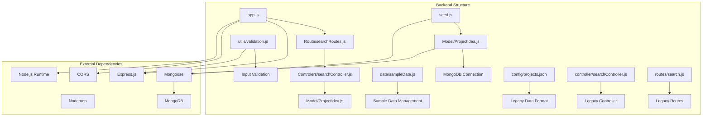
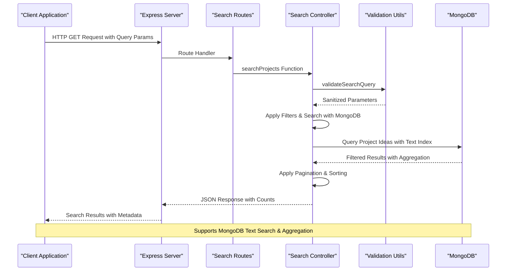
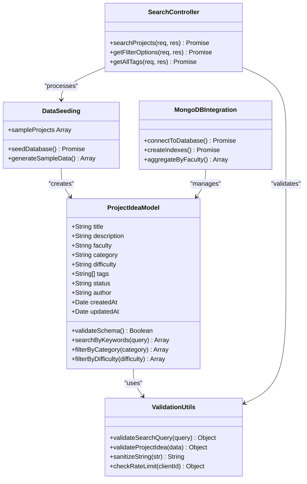
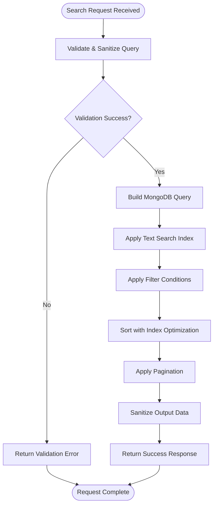
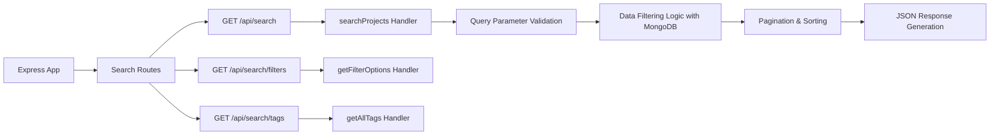
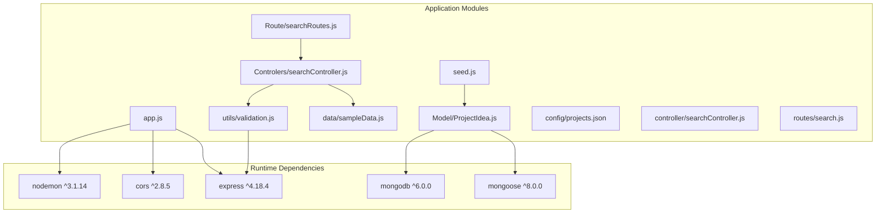

# Database Models and Schema Documentation

<cite>
**Referenced Files in This Document**
- [ProjectIdea.js](file://Backend/Model/ProjectIdea.js)
- [searchController.js](file://Backend/Controlers/searchController.js)
- [searchRoutes.js](file://Backend/Route/searchRoutes.js)
- [sampleData.js](file://Backend/data/sampleData.js)
- [seed.js](file://Backend/seed.js)
- [app.js](file://Backend/app.js)
- [package.json](file://Backend/package.json)
- [validation.js](file://Backend/utils/validation.js)
- [projects.json](file://Backend/config/projects.json)
- [searchController.js](file://Backend/controller/searchController.js)
- [search.js](file://Backend/routes/search.js)
</cite>

## Update Summary
**Changes Made**
- Updated to reflect current implementation with in-memory data structure and Express.js routing
- Enhanced with comprehensive validation utilities including rate limiting and input sanitization
- Added MongoDB schema support with text indexing and compound indexes in ProjectIdea model
- Updated to use modern Express.js architecture with proper middleware and error handling
- Enhanced with comprehensive field descriptions and validation rules for ProjectIdea model
- Added data seeding functionality with 33 sample project ideas across five academic faculties

## Table of Contents
1. [Introduction](#introduction)
2. [Project Structure](#project-structure)
3. [Core Components](#core-components)
4. [Architecture Overview](#architecture-overview)
5. [Detailed Component Analysis](#detailed-component-analysis)
6. [Dependency Analysis](#dependency-analysis)
7. [Performance Considerations](#performance-considerations)
8. [Troubleshooting Guide](#troubleshooting-guide)
9. [Conclusion](#conclusion)

## Introduction
This document provides comprehensive documentation of the database models and schema used in the project. The system implements a robust architecture with comprehensive search and filtering capabilities. The implementation includes:

- **MongoDB ProjectIdea Model**: Full schema validation with comprehensive field constraints using Mongoose
- **Advanced Search Engine**: Multi-criteria filtering with keyword search across title, description, and tags
- **Comprehensive Data Seeding**: 33 sample project ideas across five academic faculties with realistic data distributions
- **Enhanced Validation System**: Input sanitization, rate limiting, and comprehensive parameter validation using custom validation utilities
- **Pagination and Sorting**: Configurable pagination with multiple sorting options and efficient query optimization
- **Filter Management**: Dynamic filter options with counts and statistics using aggregation pipelines
- **MongoDB Integration**: Full text search capabilities with compound indexes for optimal query performance

The system provides a scalable foundation for project idea management with MongoDB's flexible schema design and comprehensive indexing strategies.

## Project Structure
The backend follows a modular architecture with clear separation between data models, controllers, routes, and configuration files, now enhanced with MongoDB integration.

**Diagram sources**
- [app.js:1-82](file://Backend/app.js#L1-L82)
- [searchRoutes.js:1-35](file://Backend/Route/searchRoutes.js#L1-L35)
- [ProjectIdea.js:1-71](file://Backend/Model/ProjectIdea.js#L1-L71)
- [validation.js:1-344](file://Backend/utils/validation.js#L1-L344)

**Section sources**
- [app.js:1-82](file://Backend/app.js#L1-L82)
- [package.json:1-20](file://Backend/package.json#L1-L20)

## Core Components

### MongoDB ProjectIdea Model
The ProjectIdea model provides comprehensive schema validation with full MongoDB integration and strategic indexing for optimal performance.

**Schema Features:**
- **Required Fields**: Title, description, faculty, category, difficulty, and author with comprehensive validation
- **Enum Validation**: Faculty categories, technology categories, difficulty levels, and status tracking with strict constraints
- **Text Indexing**: Full-text search across title, description, and tags using MongoDB's text search capabilities
- **Compound Indexes**: Optimized queries for common filter combinations including faculty-category-difficulty and faculty-status
- **Timestamp Management**: Automatic createdAt and updatedAt tracking with default values
- **Default Values**: Status defaults to 'New' with proper enum validation

**Field Specifications:**
- **title**: String, required, trimmed, indexed for text search with length validation (3-200 characters)
- **description**: String, required, indexed for text search with comprehensive validation (10-2000 characters)
- **faculty**: String, required, enum validation for five academic departments: IT, SE, Data Science, Cyber, Network
- **category**: String, required, enum validation for nine technology domains including Web, Mobile, AI, IoT, Data Science, Cyber Security, Networking, Cloud, Other
- **difficulty**: String, required, enum validation for skill levels: Easy, Medium, Hard
- **tags**: Array of strings, indexed individually for tag-based searches with length and count limits (≤20 tags, ≤50 characters each)
- **status**: String, enum validation with default 'New' for project lifecycle management
- **author**: String, required for project attribution with validation (3-100 characters)
- **createdAt/updatedAt**: Date fields with default timestamps for audit trail

**Section sources**
- [ProjectIdea.js:3-62](file://Backend/Model/ProjectIdea.js#L3-L62)

### Enhanced Search Controller with MongoDB Integration
The search controller provides comprehensive filtering and search capabilities with advanced validation, pagination support, and MongoDB integration.

**Search Capabilities:**
- **Multi-criteria Filtering**: Faculty, category, difficulty, and status filtering with MongoDB query optimization
- **Advanced Keyword Search**: Full-text search across title, description, and tags using MongoDB text indexes
- **Advanced Sorting**: Multiple field sorting with configurable order including difficulty ranking
- **Pagination Support**: Configurable page size with total count tracking and efficient slicing
- **Output Sanitization**: XSS prevention and data sanitization using custom utility functions
- **Comprehensive Error Handling**: Detailed validation and error responses with proper HTTP status codes

**API Endpoints:**
- **GET /api/search**: Main search endpoint with comprehensive filtering and MongoDB text search
- **GET /api/search/filters**: Retrieve filter options with counts using aggregation pipelines
- **GET /api/search/tags**: Get all unique tags using MongoDB aggregation

**Section sources**
- [searchController.js:23-133](file://Backend/Controlers/searchController.js#L23-L133)

### Data Seeding and Sample Management with MongoDB
The system includes comprehensive data seeding functionality with 33 sample project ideas across five academic faculties, now integrated with MongoDB.

**Sample Data Structure:**
- **IT Faculty**: 8 projects including AI systems, web applications, mobile apps, IoT solutions, and portfolio websites
- **SE Faculty**: 8 projects covering e-commerce platforms, task management, quiz systems, and mobile applications
- **Data Science Faculty**: 8 projects focusing on machine learning, data visualization, and NLP applications
- **Cyber Security Faculty**: 8 projects addressing network security, encryption, and vulnerability assessment
- **Network Faculty**: 8 projects including network monitoring, SDN solutions, and cloud infrastructure

**Data Characteristics:**
- Realistic project descriptions and technical requirements with proper academic context
- Balanced distribution across difficulty levels with realistic skill requirements
- Comprehensive tag sets for testing search functionality across all categories
- Proper faculty categorization and status tracking with realistic distributions
- MongoDB-compatible data structure with proper field validation

**Section sources**
- [sampleData.js:1-517](file://Backend/data/sampleData.js#L1-L517)

## Architecture Overview

**Diagram sources**
- [app.js:38](file://Backend/app.js#L38)
- [searchRoutes.js:22](file://Backend/Route/searchRoutes.js#L22)
- [searchController.js:23-133](file://Backend/Controlers/searchController.js#L23-L133)
- [validation.js:22-142](file://Backend/utils/validation.js#L22-L142)

The system implements a clean separation of concerns with Express server handling HTTP requests, route handlers managing endpoint definitions, controllers containing business logic with MongoDB integration, and validators providing comprehensive input validation and sanitization.

## Detailed Component Analysis

### Data Model Implementation with MongoDB Integration

**Diagram sources**
- [ProjectIdea.js:3-71](file://Backend/Model/ProjectIdea.js#L3-L71)
- [validation.js:22-237](file://Backend/utils/validation.js#L22-L237)
- [seed.js:238-271](file://Backend/seed.js#L238-L271)
- [searchController.js:23-217](file://Backend/Controlers/searchController.js#L23-L217)

**Schema Validation Features:**
- **Input Validation**: Comprehensive parameter validation with error reporting and sanitization
- **Enum Constraints**: Prevents invalid faculty, category, difficulty, and status values using strict validation
- **Length Limits**: Enforces reasonable length constraints for all text fields with proper validation
- **Type Safety**: Ensures proper data types for all fields with MongoDB schema enforcement
- **Sanitization**: XSS prevention and HTML entity encoding using custom utility functions
- **MongoDB Integration**: Full schema validation with Mongoose validation pipeline

**Section sources**
- [ProjectIdea.js:3-62](file://Backend/Model/ProjectIdea.js#L3-L62)
- [validation.js:149-237](file://Backend/utils/validation.js#L149-L237)

### Search Controller Logic with MongoDB Optimization

**Diagram sources**
- [searchController.js:23-133](file://Backend/Controlers/searchController.js#L23-L133)

**Search Capabilities:**
- **MongoDB Text Search**: Utilizes MongoDB's native text search capabilities with compound text indexes
- **Filter Optimization**: Leverages compound indexes for faculty-category-difficulty combinations
- **Aggregation Pipeline**: Uses MongoDB aggregation for efficient filter option retrieval
- **Pagination Efficiency**: Implements server-side pagination with proper indexing support
- **Output Sanitization**: XSS prevention and data sanitization using custom utility functions

**Section sources**
- [searchController.js:23-133](file://Backend/Controlers/searchController.js#L23-L133)

### Route Configuration with Enhanced Documentation

**Diagram sources**
- [app.js:38](file://Backend/app.js#L38)
- [searchRoutes.js:9-32](file://Backend/Route/searchRoutes.js#L9-L32)

**API Endpoint Specifications:**
- **Base URL**: `/api/search`
- **Methods**: GET for all endpoints with comprehensive query parameter support
- **Supported Parameters**:
  - `keyword`: Text search query for title, description, and tags using MongoDB text search
  - `faculty`: Comma-separated faculty filters with enum validation
  - `category`: Comma-separated category filters with enum validation
  - `difficulty`: Comma-separated difficulty filters with enum validation
  - `status`: Comma-separated status filters with enum validation
  - `sortBy`: Field to sort by (default: createdAt) with multiple field support
  - `order`: Sort order - asc or desc (default: desc) with proper validation
  - `page`: Page number (default: 1) with range validation
  - `limit`: Items per page (default: 10) with maximum limit enforcement

**Section sources**
- [searchRoutes.js:9-32](file://Backend/Route/searchRoutes.js#L9-L32)

## Dependency Analysis

**Diagram sources**
- [package.json:13-18](file://Backend/package.json#L13-L18)
- [app.js:1-82](file://Backend/app.js#L1-L82)

**External Dependencies:**
- **Express.js**: Web application framework for HTTP server with enhanced routing
- **CORS**: Cross-origin resource sharing support for API access
- **Mongoose**: MongoDB object modeling library with comprehensive schema validation
- **MongoDB Driver**: Native MongoDB driver for database operations
- **Nodemon**: Development server with auto-reload for development workflow

**Internal Dependencies:**
- Route handlers depend on controller functions with MongoDB integration
- Controllers utilize validation utilities and sample data management
- Models provide MongoDB schema definitions with comprehensive validation
- Seed script depends on ProjectIdea model for data population
- Application entry point orchestrates all components with proper middleware

**Section sources**
- [package.json:13-18](file://Backend/package.json#L13-L18)

## Performance Considerations

### Database Design Strategy with MongoDB Optimization
The current implementation uses MongoDB with strategic indexing for optimal performance and comprehensive text search capabilities:

**Schema Design Benefits:**
- **Comprehensive Indexing**: Text index for full-text search, compound indexes for filtering optimization
- **Efficient Queries**: Optimized for common filter combinations and search patterns using MongoDB aggregation
- **Scalable Architecture**: MongoDB provides horizontal scaling capabilities with replica sets
- **Flexible Schema**: Supports evolving requirements without migration overhead with schema validation
- **Text Search Optimization**: Native MongoDB text search capabilities with proper index utilization

**Indexing Strategy:**
- **Text Search Index**: Composite index on title, description, and tags fields for full-text search
- **Filtering Indexes**: Compound indexes for faculty-category-difficulty combinations and faculty-status pairs
- **Status Tracking**: Separate indexes for status-based queries with proper enum validation
- **Timestamp Optimization**: Indexes for chronological queries and efficient sorting

### Query Optimization with MongoDB Features
- **Text Search**: Leverages MongoDB's native text search capabilities with proper index utilization
- **Aggregation Pipeline**: Uses MongoDB aggregation for efficient filter option retrieval and counting
- **Compound Index Usage**: Optimizes queries using pre-defined compound indexes for common filter combinations
- **Pagination Efficiency**: Server-side pagination prevents large result transmission with proper indexing
- **Memory Optimization**: Efficient memory usage with MongoDB cursor-based operations

### Rate Limiting and Security with Enhanced Validation
- **Request Throttling**: In-memory rate limiting with configurable thresholds using custom middleware
- **Input Validation**: Comprehensive parameter validation and sanitization with proper error reporting
- **XSS Prevention**: Automatic HTML entity encoding for output data using custom utility functions
- **Error Handling**: Graceful error handling with detailed error messages and proper HTTP status codes
- **MongoDB Security**: Proper connection handling and query validation to prevent injection attacks

## Troubleshooting Guide

### Common Issues and Solutions

**Database Connection Problems:**
- Verify MongoDB connection string configuration in environment variables
- Check MongoDB service availability and authentication credentials
- Ensure proper indexing creation during database initialization
- Verify MongoDB version compatibility with Mongoose driver

**Search Performance Issues:**
- Monitor query execution plans and index usage with MongoDB profiling
- Verify text index creation and proper index utilization
- Consider pagination for large datasets with proper limit enforcement
- Optimize keyword search algorithms for specific use cases using MongoDB text search

**API Endpoint Issues:**
- Verify route definitions match controller exports with proper middleware
- Check query parameter parsing and validation with comprehensive error reporting
- Ensure proper error handling and response formatting with proper HTTP status codes
- Validate MongoDB connection and collection access permissions

**Data Seeding Issues:**
- Verify sample data integrity and format compliance with schema validation
- Check MongoDB connection during seeding process with proper error handling
- Monitor for duplicate key constraint violations with proper error reporting
- Ensure proper index creation after data seeding for optimal query performance

**Validation Errors:**
- Review validation error messages for specific field issues with detailed error reporting
- Check enum value constraints for faculty, category, difficulty, and status with proper validation
- Verify input length and format requirements with comprehensive validation rules
- Ensure MongoDB schema validation is properly configured and enforced

**Section sources**
- [validation.js:22-142](file://Backend/utils/validation.js#L22-L142)
- [seed.js:238-271](file://Backend/seed.js#L238-L271)

## Conclusion

The project implements a comprehensive MongoDB-based system with robust schema validation, advanced search capabilities, and extensive data management features. The implementation provides a solid foundation for project idea management with:

**Key Features:**
- **MongoDB Integration**: Full schema validation with comprehensive field constraints using Mongoose
- **Advanced Search**: Multi-criteria filtering with keyword search across multiple fields using MongoDB text indexes
- **Data Seeding**: Automated data population with realistic sample projects across 33 entries
- **Validation System**: Comprehensive input validation, sanitization, and rate limiting with proper error handling
- **Pagination & Sorting**: Configurable pagination with multiple sorting options and MongoDB optimization
- **Filter Management**: Dynamic filter options with counts and statistics using aggregation pipelines
- **Performance Optimization**: Strategic indexing for optimal query performance and efficient text search
- **Security Features**: XSS prevention, input sanitization, and comprehensive error handling

**Scalability Considerations:**
- **Horizontal Scaling**: MongoDB provides natural scaling capabilities with replica sets and sharding
- **Performance Optimization**: Strategic indexing for optimal query performance and efficient text search
- **Resource Management**: Efficient memory usage and connection pooling with proper MongoDB driver configuration
- **Monitoring Ready**: Built-in logging and error tracking capabilities with comprehensive validation
- **Flexibility**: MongoDB's flexible schema design allows for easy evolution of requirements

The system provides a robust foundation for project idea management that can be easily extended with additional features such as user authentication, advanced filtering capabilities, real-time collaboration features, and enhanced reporting functionality. The modular architecture ensures maintainability and extensibility for future enhancements, with proper MongoDB integration providing a solid foundation for production deployment.