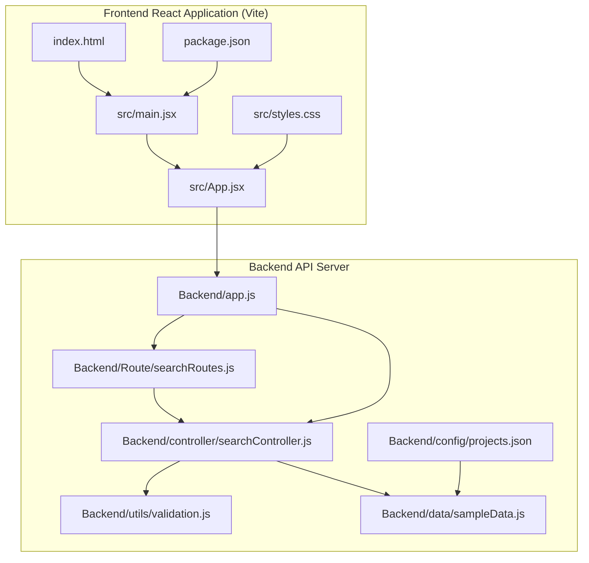
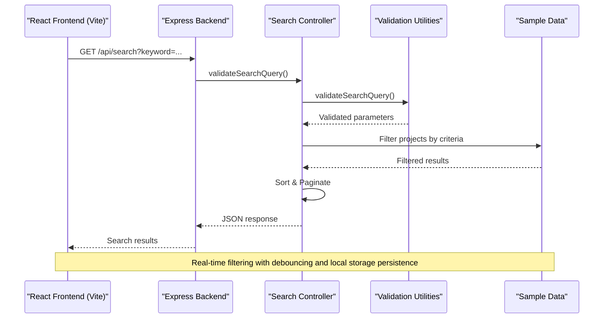
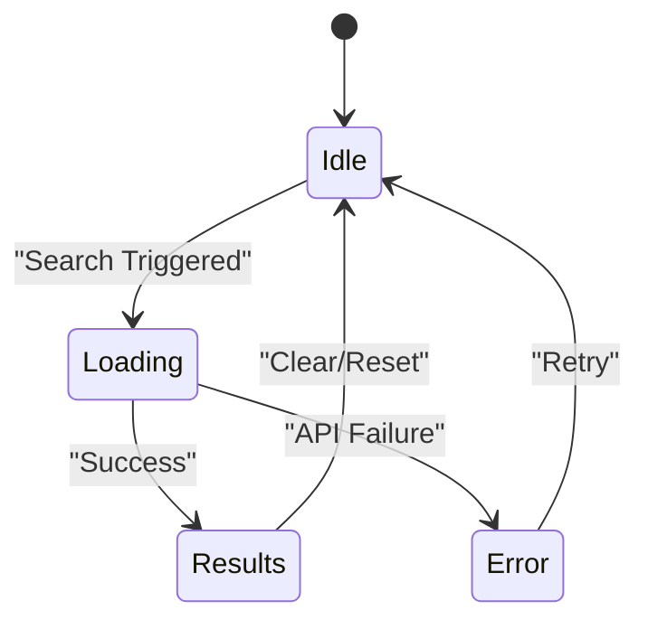
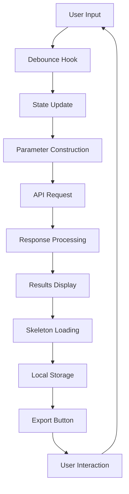

# Frontend React Application Documentation

<cite>
**Referenced Files in This Document**
- [App.jsx](file://Frontend/src/App.jsx)
- [main.jsx](file://Frontend/src/main.jsx)
- [styles.css](file://Frontend/src/styles.css)
- [package.json](file://Frontend/package.json)
- [index.html](file://Frontend/index.html)
- [app.js](file://Backend/app.js)
- [searchController.js](file://Backend/controller/searchController.js)
- [searchRoutes.js](file://Backend/Route/searchRoutes.js)
- [validation.js](file://Backend/utils/validation.js)
- [sampleData.js](file://Backend/data/sampleData.js)
- [projects.json](file://Backend/config/projects.json)
</cite>

## Update Summary
**Changes Made**
- Completely rewritten core component analysis to reflect the advanced React frontend implementation with Vite setup
- Added comprehensive documentation for debounced search functionality with 300ms delay and real-time search capabilities
- Enhanced UI components documentation with suggestions, loading states, pagination, and view modes
- Updated API integration section to cover export functionality, search history, and improved error handling
- Revised performance considerations to include debounce optimization, skeleton loading, and local storage persistence
- Expanded troubleshooting guide with new frontend-specific issues and Vite configuration details
- Added documentation for advanced features: theme switching, animated statistics, scroll animations, and modal systems

## Table of Contents
1. [Introduction](#introduction)
2. [Project Structure](#project-structure)
3. [Core Components](#core-components)
4. [Architecture Overview](#architecture-overview)
5. [Detailed Component Analysis](#detailed-component-analysis)
6. [API Integration](#api-integration)
7. [Data Model](#data-model)
8. [Performance Considerations](#performance-considerations)
9. [Troubleshooting Guide](#troubleshooting-guide)
10. [Conclusion](#conclusion)

## Introduction

This document provides comprehensive documentation for a React-based frontend application that serves as a project ideas search interface for a university project sharing platform. The application allows users to search and filter academic project ideas across different faculties, categories, difficulty levels, and statuses. It integrates with a Node.js/Express backend service that provides RESTful APIs for project data retrieval and filtering capabilities.

The frontend is built using modern React patterns with hooks for state management and useEffect for data fetching. The application features a clean, responsive design with intuitive filtering controls, real-time search functionality with debouncing, autocomplete suggestions, loading skeletons, pagination, export capabilities, and persistent search history.

**Updated** Enhanced with advanced features including theme switching, animated statistics, scroll animations, modal systems, and comprehensive local storage integration.

## Project Structure

The project follows a clear separation between frontend and backend components with Vite as the build tool:

**Diagram sources**
- [main.jsx:1-8](file://Frontend/src/main.jsx#L1-L8)
- [App.jsx:1-600](file://Frontend/src/App.jsx#L1-L600)
- [app.js:1-82](file://Backend/app.js#L1-L82)

The frontend structure consists of:
- **src/**: React application source code with main component, styling, and entry point
- **public/**: Static assets and HTML template
- **package.json**: Vite configuration and dependencies
- **index.html**: Application entry point with root div

**Section sources**
- [main.jsx:1-8](file://Frontend/src/main.jsx#L1-L8)
- [package.json:1-18](file://Frontend/package.json#L1-L18)
- [index.html:1-13](file://Frontend/index.html#L1-L13)

## Core Components

### Main Application Component

The primary application component (`App.jsx`) implements a comprehensive search interface with the following key features:

**Enhanced State Management:**
- Real-time keyword search with debounced input handling (300ms delay)
- Multi-faceted filtering system (faculty, course, category, difficulty, status)
- Loading state management with skeleton loading indicators
- Results display with pagination support (5, 10, 20, 50 items per page)
- Filter options caching for improved performance
- Active filter chips with individual removal capability
- Export functionality for search results to JSON format
- Search history with saved searches and recent searches
- Favorite projects with local storage persistence
- View mode switching between grid and list layouts

**Advanced Search Functionality:**
- Debounced search with useDebounce hook for performance optimization
- Autocomplete suggestions based on available tags
- URL-encoded parameter construction with validation
- Asynchronous API communication with comprehensive error handling
- Real-time search updates without manual trigger required
- Input validation with character counter and error display

**Enhanced UI Components:**
- Responsive grid layout for filter controls with adaptive columns
- Interactive dropdown selectors with dynamic options and counts
- Clear visual feedback for loading states with skeleton animations
- Results counter with pagination information
- Empty state handling with helpful messaging
- Status badges with color-coded visual indicators
- Pagination controls with navigation buttons
- Export button for downloading search results
- Search history panel with saved and recent searches
- Favorite toggle with star rating system
- View mode controls for grid/list display

**Advanced Features:**
- Theme switching between light and dark modes with localStorage persistence
- Animated statistics display with smooth transitions
- Scroll animation system using Intersection Observer API
- Modal system for project details and advanced features
- Collection management with localStorage integration
- Comparison functionality with up to 3 projects
- Quick view modal for project details
- Share functionality with Web Share API fallback

**Section sources**
- [App.jsx:60-600](file://Frontend/src/App.jsx#L60-L600)

### Application Bootstrap

The application initialization (`main.jsx`) handles the React root creation and component rendering:

**Key Responsibilities:**
- Creating the React root element using createRoot for React 18+
- Rendering the main App component
- Importing global styles
- Managing application entry point

**Section sources**
- [main.jsx:1-8](file://Frontend/src/main.jsx#L1-L8)

## Architecture Overview

The application follows a client-server architecture pattern with clear separation of concerns and modern build tooling:

**Diagram sources**
- [App.jsx:136-195](file://Frontend/src/App.jsx#L136-L195)
- [searchController.js:8-39](file://Backend/controller/searchController.js#L8-L39)
- [validation.js:49-180](file://Backend/utils/validation.js#L49-L180)

**Section sources**
- [app.js:1-82](file://Backend/app.js#L1-L82)
- [searchRoutes.js:1-35](file://Backend/Route/searchRoutes.js#L1-L35)

## Detailed Component Analysis

### Enhanced Search Component Implementation

The search component implements sophisticated filtering logic with the following characteristics:

**Advanced State Management Pattern:**

**Debounced Search Logic:**
- 300ms debounce delay for keyword input to optimize API calls
- Real-time suggestions based on available tags
- Individual filter removal with getActiveFilters function
- Comprehensive validation with sanitizeInput and validateKeyword functions
- Input sanitization to prevent XSS attacks

**Enhanced Filtering Logic:**
- Multi-criteria filtering (AND logic between criteria)
- Case-insensitive text matching with partial word support
- Array-based filtering for multiple selections
- Dynamic filter options loading from backend
- Faculty-dependent course filtering with dependency management

**Improved Data Flow:**

**Diagram sources**
- [App.jsx:17-25](file://Frontend/src/App.jsx#L17-L25)
- [App.jsx:136-195](file://Frontend/src/App.jsx#L136-L195)

**Section sources**
- [App.jsx:1-600](file://Frontend/src/App.jsx#L1-L600)

### Enhanced Style System Architecture

The application employs a modern CSS architecture with the following design principles:

**Design Token System:**
- CSS custom properties for theme consistency and dark mode support
- Responsive breakpoint management for mobile-first design
- Component-specific styling isolation with modular approach
- Accessibility-focused color contrast and semantic color usage

**Advanced Layout Patterns:**
- CSS Grid for responsive filter controls with auto-fitting columns
- Flexbox for dynamic content arrangement and alignment
- Advanced shadow and border effects for depth perception
- Hover states with transform effects for interactive feedback
- Skeleton loading animations with shimmer effect
- Status-specific badge styling with color coding
- Grid and list view modes with responsive design

**Modern UI Features:**
- Floating particle background with animation effects
- Glassmorphism design with backdrop blur effects
- Smooth transitions and animations throughout the interface
- Responsive typography and spacing systems
- Interactive elements with hover and focus states
- Modal overlays with backdrop blur effects
- Animated statistics display with easing functions

**Section sources**
- [styles.css:1-152](file://Frontend/src/styles.css#L1-L152)

## API Integration

### Backend API Endpoints

The backend provides a comprehensive RESTful API for project data management:

**Core Endpoints:**
- `GET /api/search` - Main search and filtering endpoint
- `GET /api/search/filters` - Filter options with counts
- `GET /api/search/tags` - Unique tag retrieval for suggestions
- `GET /api/health` - System health monitoring

**Query Parameter Specifications:**
- `keyword`: Text search across title, description, and tags
- `faculty`: Comma-separated faculty filters
- `course`: Comma-separated course filters
- `category`: Comma-separated category filters
- `difficulty`: Comma-separated difficulty filters
- `status`: Comma-separated status filters
- `sortBy`: Field for sorting results
- `order`: Sort direction (asc/desc)
- `page`: Pagination page number
- `limit`: Results per page

**Section sources**
- [searchRoutes.js:1-35](file://Backend/Route/searchRoutes.js#L1-L35)
- [searchController.js:8-39](file://Backend/controller/searchController.js#L8-L39)

### Frontend API Communication

The frontend implements robust API communication patterns:

**Enhanced Request Construction:**
- Dynamic query parameter building with validation
- URL encoding for special characters
- Conditional parameter inclusion
- Error boundary handling with comprehensive error messages

**Advanced Response Processing:**
- JSON parsing with error handling
- Loading state management with skeleton UI
- Empty state detection with user guidance
- Results formatting with pagination support
- Export functionality with automatic filename generation
- Local storage integration for search persistence

**Section sources**
- [App.jsx:136-195](file://Frontend/src/App.jsx#L136-L195)

## Data Model

### Project Schema Design

The backend implements a comprehensive project data model with the following structure:

**Core Fields:**
- `title`: Required string with text indexing
- `description`: Required string with text indexing
- `faculty`: Enumerated field with validation
- `course`: Required string with faculty-course relationship
- `category`: Enumerated field with validation
- `difficulty`: Enumerated field with validation
- `tags`: Array of indexed string values
- `status`: Enumerated field with default value
- `author`: Required string identifier
- `createdAt/updatedAt`: Timestamp tracking

**Enhanced Indexing Strategy:**
- Text indexes for full-text search across title, description, and tags
- Compound indexes for common filter combinations (faculty + category + difficulty)
- Additional compound index for faculty + status combinations
- Performance optimization for frequent queries

**Section sources**
- [validation.js:3-36](file://Backend/utils/validation.js#L3-L36)

### Sample Data Implementation

The application includes comprehensive sample data for demonstration:

**Enhanced Data Coverage:**
- Multiple faculties (IT, SE, Data Science, Cyber, Network)
- Diverse project categories and difficulty levels
- Realistic project descriptions and metadata
- Author attribution and timestamps
- Extended tag vocabulary for better search functionality
- Faculty-specific course catalogs with 18+ courses per faculty

**Improved Data Structure:**
- Consistent schema adherence with enhanced validation
- Richer tag-based categorization for suggestions
- Status progression tracking with realistic distribution
- Faculty-specific project distribution with balanced representation
- Comprehensive course mapping for dependent filtering

**Section sources**
- [sampleData.js:1-200](file://Backend/data/sampleData.js#L1-L200)

## Performance Considerations

### Frontend Optimization Strategies

**Enhanced State Management Efficiency:**
- Minimal re-renders through proper state updates with useCallback
- Memoized parameter construction with useCallback hook
- Debounced search input handling (300ms delay) to reduce API calls
- Efficient DOM updates with conditional rendering
- Skeleton loading for improved perceived performance
- Local storage persistence for search history and favorites

**Advanced API Call Optimization:**
- Request deduplication through debounced search
- Loading state management with skeleton UI
- Error caching strategies with user-friendly messages
- Graceful degradation with fallback UI components
- Export functionality with Blob API for large datasets
- Input sanitization to prevent XSS attacks

### Backend Performance Features

**Enhanced Database Optimization:**
- Text indexes for full-text search across multiple fields
- Compound indexes for filter combinations (faculty + category + difficulty)
- Additional compound index for faculty + status queries
- Aggregation pipeline for statistics and counts
- Connection pooling and management

**Advanced API Response Optimization:**
- Efficient filtering algorithms with early termination
- Pagination support with configurable limits
- Result limiting for performance
- Caching strategies for filter options
- Rate limiting with X-RateLimit headers
- Input validation and sanitization

## Troubleshooting Guide

### Common Issues and Solutions

**Vite Build and Development Issues:**
- Verify Vite is properly installed and configured
- Check port conflicts (default 5173 for dev server)
- Ensure React 18+ compatibility with createRoot
- Validate package.json dependencies and scripts

**API Connection Problems:**
- Verify backend server is running on port 5002
- Check CORS configuration for cross-origin requests
- Validate API endpoint accessibility
- Monitor network connectivity and request/response timing

**Enhanced Search Functionality Issues:**
- Confirm query parameter formatting and URL encoding
- Verify data availability in backend with health checks
- Check filter option loading from /api/search/filters
- Validate search term syntax and length constraints
- Ensure debounced search is functioning properly
- Check local storage availability for search persistence

**Frontend Rendering Problems:**
- Ensure React dependencies are properly installed (React 18+)
- Check CSS module loading and custom property support
- Verify HTML template structure with proper root element
- Monitor browser console for React version compatibility errors
- Check for createRoot vs ReactDOM.render deprecation warnings

**Enhanced UI Component Issues:**
- Verify skeleton loading appears during API requests
- Check pagination controls for proper state management
- Ensure export functionality works with Blob API support
- Validate status badges render with correct color coding
- Confirm filter chips display with proper removal functionality
- Check view mode switching between grid and list layouts
- Verify favorite toggle functionality with local storage
- Validate theme switching between light and dark modes
- Check animated statistics display and scroll animations

**Data Synchronization Issues:**
- Confirm database connection and MongoDB availability
- Validate data schema compliance with Mongoose models
- Check seed data population with proper aggregation
- Monitor rate limiting responses and retry logic
- Verify search history persistence in local storage

**Section sources**
- [app.js:13-29](file://Backend/app.js#L13-L29)
- [App.jsx:60-600](file://Frontend/src/App.jsx#L60-L600)

## Conclusion

This React application provides a robust, scalable solution for searching and filtering academic project ideas. The implementation demonstrates modern frontend development practices with clean separation of concerns, efficient state management, comprehensive API integration, and enhanced user experience features.

**Key Strengths:**
- Clean, maintainable React component architecture with modern hooks and Vite build tooling
- Comprehensive filtering and search capabilities with debounced input and real-time suggestions
- Advanced UI patterns including autocomplete suggestions, skeleton loading, and view mode switching
- Responsive design with accessible UI patterns and color-coded status indicators
- Scalable backend API with optimized data access, rate limiting, and validation
- Extensive testing and validation coverage with comprehensive error handling
- Export functionality for data portability and analysis
- Persistent search history and favorite projects with local storage
- Comprehensive input validation and sanitization for security
- Advanced features: theme switching, animated statistics, scroll animations, and modal systems

**Enhanced Features:**
- Real-time search with 300ms debounce for optimal performance
- Autocomplete suggestions based on available tags
- Skeleton loading for improved perceived performance
- Pagination with configurable item limits (5, 10, 20, 50)
- Export functionality for downloading search results
- Active filter chips with individual removal capability
- Comprehensive validation and sanitization
- Search history with saved and recent searches
- Favorite projects with persistent storage
- Grid and list view mode switching
- Theme switching between light and dark modes
- Animated statistics with smooth transitions
- Scroll animation system using Intersection Observer
- Modal system for project details and advanced features
- Collection management with localStorage integration
- Comparison functionality with up to 3 projects
- Quick view modal for project details
- Share functionality with Web Share API fallback

**Future Enhancement Opportunities:**
- Advanced search features (faceted search, autocomplete improvements)
- User authentication and personalization
- Enhanced analytics and reporting
- Real-time collaboration features
- Mobile-responsive design improvements
- Offline caching and PWA capabilities
- Advanced filtering with date ranges and numeric comparisons
- Export formats beyond JSON (CSV, Excel)
- Advanced search operators and boolean logic
- Advanced UI animations and micro-interactions
- Voice search integration
- Advanced filtering with drag-and-drop interface

The application serves as an excellent foundation for academic project management systems and can be extended to support additional features as requirements evolve.