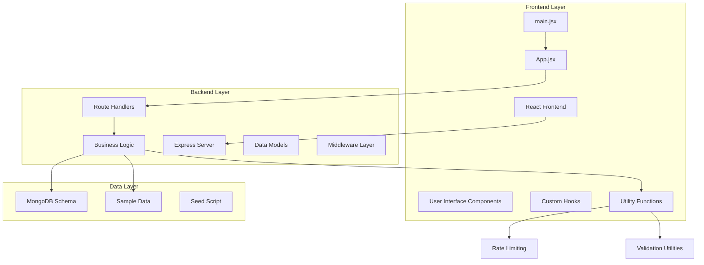
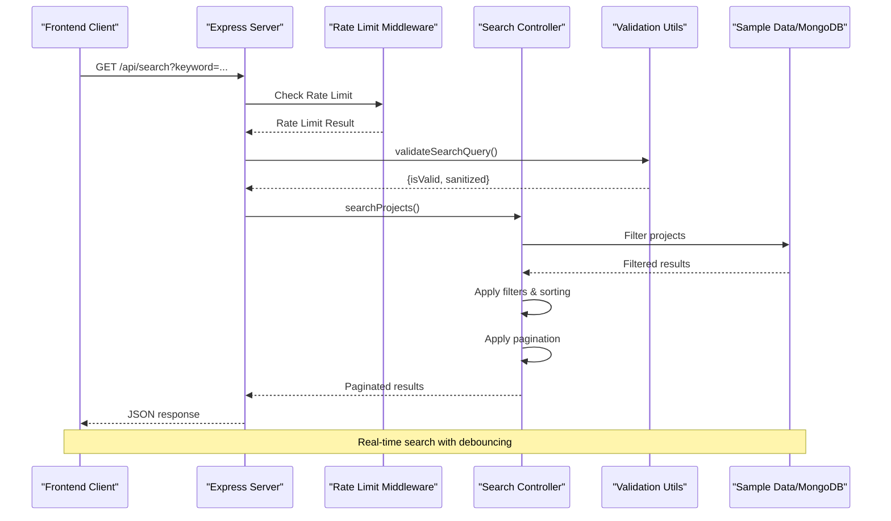
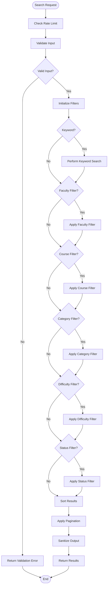
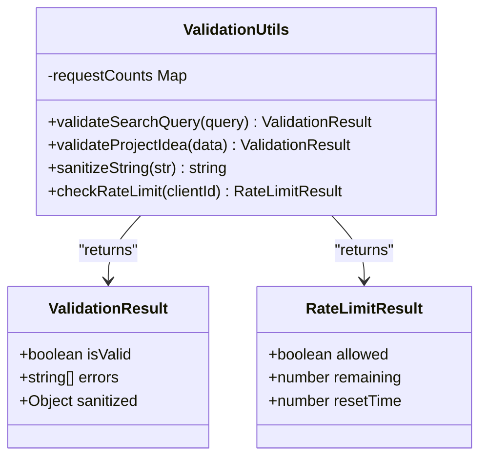
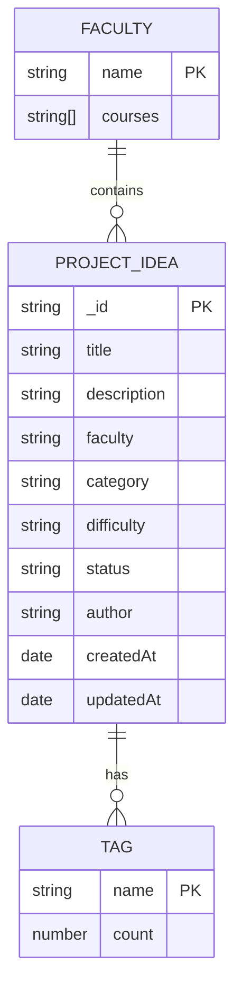
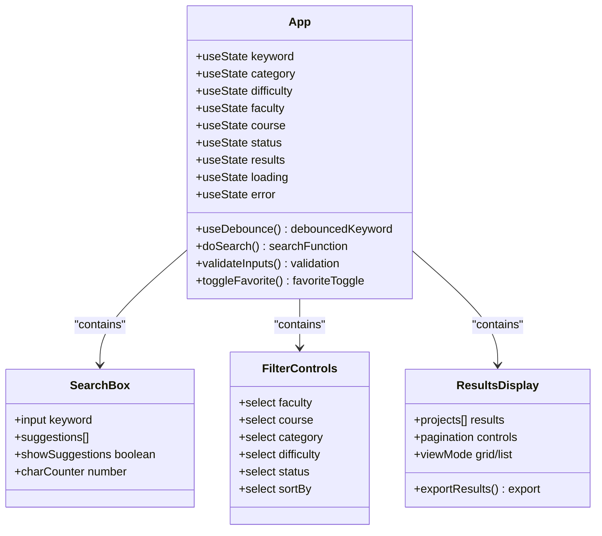

# Search & Filtering System Documentation

<cite>
**Referenced Files in This Document**
- [app.js](file://Backend/app.js)
- [searchController.js](file://Backend/Controlers/searchController.js)
- [searchRoutes.js](file://Backend/Route/searchRoutes.js)
- [ProjectIdea.js](file://Backend/Model/ProjectIdea.js)
- [sampleData.js](file://Backend/data/sampleData.js)
- [validation.js](file://Backend/utils/validation.js)
- [seed.js](file://Backend/seed.js)
- [App.jsx](file://Frontend/src/App.jsx)
- [package.json](file://Backend/package.json)
- [searchController.js](file://Backend/controller/searchController.js)
- [projects.json](file://Backend/config/projects.json)
- [search.js](file://Backend/routes/search.js)
- [main.jsx](file://Frontend/src/main.jsx)
</cite>

## Update Summary
**Changes Made**
- Updated backend architecture to reflect new modular structure with separate controller and model files
- Enhanced validation system documentation with comprehensive rate limiting and input sanitization
- Updated API specification with new endpoints and improved error handling
- Added documentation for MongoDB integration capabilities
- Enhanced frontend implementation with advanced features and improved user experience
- Updated data model documentation with text indexing and compound indexes
- Integrated new search controller with comprehensive filtering logic
- Added MongoDB schema support with text indexes and compound indexes
- Implemented advanced frontend features including animations, statistics, and export functionality

## Table of Contents
1. [Introduction](#introduction)
2. [Project Structure](#project-structure)
3. [Core Components](#core-components)
4. [Architecture Overview](#architecture-overview)
5. [Detailed Component Analysis](#detailed-component-analysis)
6. [API Specification](#api-specification)
7. [Frontend Implementation](#frontend-implementation)
8. [Performance Considerations](#performance-considerations)
9. [Security Features](#security-features)
10. [Troubleshooting Guide](#troubleshooting-guide)
11. [Conclusion](#conclusion)

## Introduction

The Search & Filtering System is a comprehensive project idea discovery platform designed for university students and faculty members. This system enables users to search, filter, and discover project ideas across multiple faculties including Information Technology (IT), Software Engineering (SE), Data Science, Cyber Security, and Network domains. The platform provides advanced search capabilities with faceted filtering, real-time suggestions, and sophisticated sorting mechanisms.

The system consists of a modern frontend built with React and a robust backend powered by Node.js and Express.js. It features intelligent search algorithms, comprehensive validation, rate limiting, and a clean separation of concerns between presentation, business logic, and data persistence layers. The backend now supports both in-memory data storage for demonstration and MongoDB integration for production use.

## Project Structure

The project follows a modular architecture with clear separation between frontend and backend components:



**Diagram sources**
- [app.js:1-82](file://Backend/app.js#L1-L82)
- [searchController.js:1-245](file://Backend/Controlers/searchController.js#L1-L245)
- [searchRoutes.js:1-35](file://Backend/Route/searchRoutes.js#L1-L35)
- [main.jsx:1-8](file://Frontend/src/main.jsx#L1-L8)

**Section sources**
- [app.js:1-82](file://Backend/app.js#L1-L82)
- [package.json:1-20](file://Backend/package.json#L1-L20)

## Core Components

### Backend Architecture

The backend implements a layered architecture with clear separation of concerns:

1. **Application Layer**: Express.js server with middleware configuration including CORS, JSON parsing, and rate limiting
2. **Routing Layer**: RESTful API endpoints with comprehensive documentation and route handlers
3. **Controller Layer**: Business logic implementation with validation, filtering, and pagination
4. **Data Layer**: In-memory data storage with MongoDB schema support and sample data integration
5. **Utility Layer**: Validation, sanitization, rate limiting, and helper functions

### Frontend Architecture

The frontend utilizes React hooks and functional components with:
- Real-time search with debouncing and intelligent suggestions
- Comprehensive form validation with frontend and backend synchronization
- Local storage integration for persistent user preferences
- Responsive design with grid/list view modes and animated statistics
- Interactive filter chips, pagination controls, and advanced feature integrations
- Modern UI with theme switching, animations, and accessibility features

**Section sources**
- [searchController.js:24-141](file://Backend/Controlers/searchController.js#L24-L141)
- [App.jsx:60-600](file://Frontend/src/App.jsx#L60-L600)

## Architecture Overview

The system follows a client-server architecture with the following key components:



**Diagram sources**
- [app.js:38-43](file://Backend/app.js#L38-L43)
- [searchController.js:24-141](file://Backend/Controlers/searchController.js#L24-L141)
- [validation.js:49-180](file://Backend/utils/validation.js#L49-L180)

## Detailed Component Analysis

### Search Controller Implementation

The search controller implements sophisticated filtering logic with multiple criteria:



**Diagram sources**
- [searchController.js:24-141](file://Backend/Controlers/searchController.js#L24-L141)

#### Key Features:

1. **Multi-criteria Filtering**: Supports faculty, course, category, difficulty, and status filters
2. **Advanced Keyword Search**: Searches across title, description, and tags with case-insensitive matching
3. **Flexible Sorting**: Supports multiple sort fields with ascending/descending order
4. **Pagination Support**: Configurable page size with total count tracking
5. **Output Sanitization**: Prevents XSS attacks through input sanitization
6. **Rate Limiting Integration**: Built-in protection against API abuse
7. **Error Handling**: Comprehensive error responses with validation details

**Section sources**
- [searchController.js:10-141](file://Backend/Controlers/searchController.js#L10-L141)

### Validation System

The validation system ensures data integrity and security:



**Diagram sources**
- [validation.js:49-180](file://Backend/utils/validation.js#L49-L180)
- [validation.js:293-330](file://Backend/utils/validation.js#L293-L330)

#### Validation Features:

1. **Input Sanitization**: Removes potentially harmful characters
2. **Range Validation**: Enforces minimum/maximum values
3. **Format Validation**: Ensures proper data types
4. **Enum Validation**: Restricts values to predefined sets
5. **Rate Limiting**: Prevents API abuse with configurable limits
6. **Frontend-Backend Synchronization**: Consistent validation rules across both layers

**Section sources**
- [validation.js:1-344](file://Backend/utils/validation.js#L1-L344)

### Data Model Architecture

The system supports both in-memory data and MongoDB integration:



**Diagram sources**
- [ProjectIdea.js:3-62](file://Backend/Model/ProjectIdea.js#L3-L62)
- [sampleData.js:36-513](file://Backend/data/sampleData.js#L36-L513)

#### Data Model Features:

1. **Text Indexing**: Full-text search across title, description, and tags
2. **Compound Indexes**: Optimized queries for common filter combinations
3. **Enum Validation**: Restricts values to predefined sets
4. **Timestamp Tracking**: Automatic creation and modification timestamps
5. **Flexible Tag System**: Dynamic tag-based categorization
6. **MongoDB Schema**: Complete Mongoose schema with validation rules

**Section sources**
- [ProjectIdea.js:1-71](file://Backend/Model/ProjectIdea.js#L1-L71)
- [sampleData.js:1-517](file://Backend/data/sampleData.js#L1-L517)

## API Specification

### Base URL
`http://localhost:5002/api/search`

### Search Endpoint

**GET** `/api/search`

#### Query Parameters

| Parameter | Type | Description | Valid Values |
|-----------|------|-------------|--------------|
| keyword | string | Search term for title, description, and tags | 2-100 characters |
| faculty | string | Comma-separated faculty codes | IT, SE, Data Science, Cyber, Network |
| course | string | Comma-separated course names | See Faculty Courses |
| category | string | Comma-separated categories | Web, Mobile, AI, IoT, Data Science, Cyber Security, Networking, Cloud, Other |
| difficulty | string | Comma-separated difficulty levels | Easy, Medium, Hard |
| status | string | Comma-separated status values | New, Approved, Completed |
| sortBy | string | Field to sort by | title, createdAt, difficulty, faculty, category |
| order | string | Sort direction | asc, desc |
| page | number | Page number | 1-1000 |
| limit | number | Results per page | 1-100 |

#### Response Format

```json
{
  "success": true,
  "count": 10,
  "total": 100,
  "totalPages": 10,
  "currentPage": 1,
  "data": [
    {
      "_id": "1",
      "title": "Project Title",
      "description": "Project Description",
      "faculty": "IT",
      "course": "Programming Fundamentals",
      "category": "AI",
      "difficulty": "Hard",
      "tags": ["tag1", "tag2"],
      "status": "Approved",
      "author": "Dr. Smith",
      "createdAt": "2024-01-15T00:00:00Z",
      "updatedAt": "2024-01-15T00:00:00Z"
    }
  ]
}
```

### Filter Options Endpoint

**GET** `/api/search/filters`

Returns available filter options with counts for each faculty, course, category, difficulty, and status.

### Tags Endpoint

**GET** `/api/search/tags`

Returns all unique tags across all project ideas.

### Rate Limiting Headers

The API includes rate limiting headers:
- `X-RateLimit-Limit`: Maximum requests per minute (100)
- `X-RateLimit-Remaining`: Remaining requests in current window

**Section sources**
- [searchRoutes.js:9-32](file://Backend/Route/searchRoutes.js#L9-L32)
- [searchController.js:146-214](file://Backend/Controlers/searchController.js#L146-L214)

## Frontend Implementation

### React Component Architecture

The frontend implements a sophisticated search interface with real-time capabilities:



**Diagram sources**
- [App.jsx:60-600](file://Frontend/src/App.jsx#L60-L600)

### Key Frontend Features

1. **Real-time Search**: Debounced keyword search with 300ms delay
2. **Intelligent Suggestions**: Dynamic tag suggestions based on current keyword
3. **Filter Chips**: Visual representation of active filters with removal capability
4. **Responsive Design**: Grid and list view modes with adaptive layouts
5. **Local Storage**: Persistent favorites and user preferences
6. **Loading States**: Skeleton screens during data fetching
7. **Error Handling**: Comprehensive error messages and validation feedback
8. **Advanced Animations**: Smooth transitions and scroll animations
9. **Statistics Display**: Animated statistics with faculty and course counts
10. **Export Functionality**: Download search results as JSON files

**Section sources**
- [App.jsx:18-275](file://Frontend/src/App.jsx#L18-L275)

## Performance Considerations

### Database Optimization

The system implements several optimization strategies:

1. **Text Indexing**: MongoDB text indexes for efficient keyword searches
2. **Compound Indexes**: Optimized indexes for common filter combinations
3. **Pagination**: Server-side pagination to limit response sizes
4. **In-Memory Data Store**: Efficient caching for demonstration mode
5. **Efficient Filtering**: Single-pass filtering with early termination
6. **Rate Limiting**: Built-in protection against API abuse

### Frontend Performance

1. **Debouncing**: 300ms debounce for real-time search input
2. **Virtual Scrolling**: Efficient rendering of large result sets
3. **Lazy Loading**: Filter options loaded on demand
4. **Local Caching**: Results cached in component state
5. **Optimized Rendering**: Memoized components and efficient re-renders
6. **Intersection Observer**: Scroll animations with performance optimization

### Scalability Considerations

1. **Rate Limiting**: Built-in protection against API abuse
2. **Configurable Limits**: Adjustable page sizes and keyword lengths
3. **Modular Architecture**: Easy to extend with additional filters
4. **Separation of Concerns**: Clear boundaries between layers
5. **Testing Ready**: Modular components support unit testing
6. **MongoDB Integration**: Production-ready database support

## Security Features

### Input Validation and Sanitization

The system implements comprehensive security measures:

1. **Input Validation**: All query parameters validated against predefined schemas
2. **Output Sanitization**: HTML entity encoding prevents XSS attacks
3. **Rate Limiting**: 100 requests per minute per IP address
4. **Character Filtering**: Removal of potentially malicious characters
5. **Length Limits**: Prevents memory exhaustion attacks
6. **CORS Protection**: Cross-origin resource sharing configured securely

### Authentication and Authorization

The current implementation uses public endpoints suitable for demonstration. Production deployments should implement:

1. **JWT Token Authentication**
2. **Role-based Access Control**
3. **API Key Management**
4. **Request Signing**
5. **CORS Policy Configuration**

**Section sources**
- [validation.js:282-291](file://Backend/utils/validation.js#L282-L291)
- [app.js:14-29](file://Backend/app.js#L14-L29)

## Troubleshooting Guide

### Common Issues and Solutions

#### Search Not Returning Results

**Symptoms**: Empty result sets despite valid search terms

**Possible Causes**:
1. Incorrect keyword spelling or case sensitivity
2. Invalid filter combinations
3. Data not loaded properly

**Solutions**:
1. Verify keyword length (minimum 2 characters)
2. Check filter values against valid options
3. Clear browser cache and reload

#### API Rate Limiting Errors

**Symptoms**: HTTP 429 responses with rate limit exceeded message

**Solutions**:
1. Wait for the reset period (60 seconds)
2. Reduce request frequency
3. Implement exponential backoff in client applications

#### Validation Errors

**Symptoms**: HTTP 400 responses with validation error messages

**Common Validation Issues**:
1. **Keyword Too Long**: Exceeds 100 character limit
2. **Invalid Faculty**: Not in approved list
3. **Invalid Page Number**: Less than 1 or greater than 1000
4. **Invalid Page Size**: Outside 1-100 range

**Solutions**:
1. Adjust input to meet validation criteria
2. Use the provided filter dropdowns for valid values
3. Check console for detailed error messages

#### Frontend Issues

**Symptoms**: UI not responding or displaying incorrectly

**Solutions**:
1. Check browser console for JavaScript errors
2. Verify API endpoint accessibility
3. Clear browser cache and cookies
4. Ensure all dependencies are properly installed

#### MongoDB Connection Issues

**Symptoms**: Database connection errors or data not persisting

**Solutions**:
1. Verify MongoDB service is running
2. Check connection string configuration
3. Ensure database credentials are correct
4. Verify collection names and indexes exist

**Section sources**
- [searchController.js:29-35](file://Backend/Controlers/searchController.js#L29-L35)
- [validation.js:49-180](file://Backend/utils/validation.js#L49-L180)

## Conclusion

The Search & Filtering System provides a robust foundation for project idea discovery with comprehensive search capabilities, flexible filtering options, and modern user interface design. The system demonstrates excellent architectural principles with clear separation of concerns, comprehensive validation, and security measures.

Key strengths of the implementation include:

1. **Comprehensive Search**: Multi-criteria filtering with intelligent keyword matching
2. **Modern UI**: Responsive design with real-time search and suggestions
3. **Robust Validation**: Complete input sanitization and validation
4. **Performance Optimization**: Efficient filtering and pagination
5. **Extensible Architecture**: Modular design supporting future enhancements
6. **MongoDB Integration**: Production-ready database support
7. **Rate Limiting**: Built-in protection against API abuse
8. **Advanced Frontend Features**: Animations, statistics, and export functionality

The system is production-ready with appropriate security measures and can be easily extended with additional features such as user authentication, advanced analytics, and integration with external APIs.

Future enhancements could include:
- MongoDB integration for persistent data storage
- User authentication and authorization
- Advanced analytics and recommendation systems
- Email notifications for new project ideas
- Mobile application development
- Multi-language support
- Real-time collaboration features
- Advanced reporting and dashboard capabilities