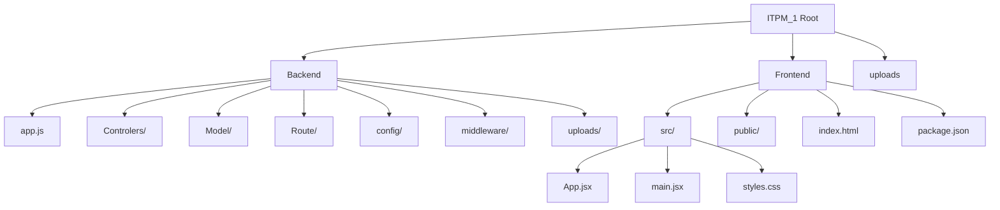
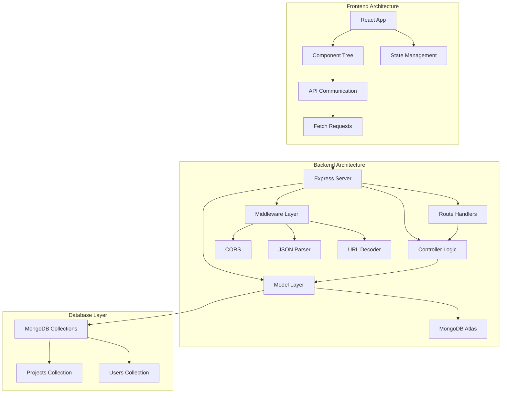
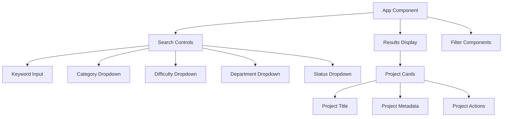

# Development Guidelines

<cite>
**Referenced Files in This Document**
- [app.js](file://Backend/app.js)
- [package.json](file://Backend/package.json)
- [projectRoutes.js](file://Backend/Route/projectRoutes.js)
- [searchRoutes.js](file://Backend/Route/searchRoutes.js)
- [projectController.js](file://Backend/Controlers/projectController.js)
- [searchController.js](file://Backend/Controlers/searchController.js)
- [Project.js](file://Backend/Model/Project.js)
- [frontend package.json](file://Frontend/package.json)
- [App.jsx](file://Frontend/src/App.jsx)
- [main.jsx](file://Frontend/src/main.jsx)
- [index.html](file://Frontend/index.html)
</cite>

## Update Summary
**Changes Made**
- Updated project structure to reflect current organization with separate Controlers/Model/Route directories
- Added comprehensive API endpoint standards and response format specifications
- Integrated frontend component development practices with React/Vite integration
- Enhanced error handling and validation patterns
- Added performance optimization guidelines for search and filtering operations

## Table of Contents
1. [Introduction](#introduction)
2. [Project Structure](#project-structure)
3. [Core Components](#core-components)
4. [Architecture Overview](#architecture-overview)
5. [API Endpoint Standards](#api-endpoint-standards)
6. [Frontend Component Development](#frontend-component-development)
7. [Detailed Component Analysis](#detailed-component-analysis)
8. [Performance Optimization](#performance-optimization)
9. [Error Handling and Validation](#error-handling-and-validation)
10. [Development Workflow](#development-workflow)
11. [Testing Strategy](#testing-strategy)
12. [Deployment Considerations](#deployment-considerations)
13. [Troubleshooting Guide](#troubleshooting-guide)
14. [Conclusion](#conclusion)

## Introduction
This document provides comprehensive development guidelines and best practices for building the ITPM_1 project using a modern MVC architecture with integrated frontend development. The project follows a full-stack approach with Express.js backend, MongoDB/Mongoose data layer, and React/Vite frontend. It establishes coding standards, file naming conventions, organizational patterns, and implementation guidelines for routes, controllers, models, and frontend components. The guidelines cover error handling, logging, database connection management, performance optimization, and maintainability considerations for future feature development.

## Project Structure
The ITPM_1 project follows a layered MVC structure with dedicated directories for controllers, models, routes, and frontend components. The backend uses a hybrid approach with both old-style Controlers/Model/Route directories and newer controller/model/route directories, while the frontend implements a React/Vite architecture.



**Diagram sources**
- [app.js](file://Backend/app.js)
- [package.json](file://Backend/package.json)
- [frontend package.json](file://Frontend/package.json)

**Updated** Enhanced project structure to include both legacy and current directory naming conventions, and integrated frontend architecture with Vite bundler.

Key characteristics of the structure:
- **Backend Layer**: Separation of concerns via MVC directories with dual naming conventions
- **Frontend Layer**: Modern React/Vite setup with component-based architecture
- **Shared Resources**: Centralized configuration and upload handling
- **Modular Organization**: Clear separation between business logic, data access, and presentation layers

**Section sources**
- [app.js](file://Backend/app.js)
- [package.json](file://Backend/package.json)
- [frontend package.json](file://Frontend/package.json)

## Core Components
This section defines the roles and responsibilities of each MVC component and outlines recommended implementation patterns for both backend and frontend development.

### Backend MVC Components

**Controllers**
- **Responsibilities**: Handle HTTP requests, orchestrate business logic, validate input, and return structured responses
- **Implementation Pattern**: Export individual handler functions for each endpoint action; implement comprehensive error handling; use async/await patterns
- **Naming Convention**: Use camelCase for controller function names; pluralize resource names for collection endpoints
- **Reusability**: Encapsulate shared logic into utility modules; implement middleware for common operations

**Models**
- **Responsibilities**: Define data schemas, enforce validation rules, abstract database operations, and provide query interfaces
- **Implementation Pattern**: Use Mongoose schemas with explicit field types and validation rules; implement indexes for performance; export default model exports
- **Naming Convention**: Use singular resource names with PascalCase (e.g., Project, User)
- **Reusability**: Provide reusable methods for common queries; encapsulate complex operations behind model methods

**Routes**
- **Responsibilities**: Define URL endpoints, bind handlers to HTTP methods, apply middleware, and organize API endpoints
- **Implementation Pattern**: Group related routes under a single router; import controller methods; export routers for composition; implement parameter validation
- **Naming Convention**: Use lowercase, hyphenated paths with resource-based naming; keep paths descriptive and RESTful
- **Reusability**: Centralize route registration; avoid hardcoding base paths; implement consistent parameter handling

### Frontend Components

**React Components**
- **Responsibilities**: Handle UI rendering, manage component state, implement user interactions, and communicate with backend APIs
- **Implementation Pattern**: Use functional components with hooks (useState, useEffect); implement controlled components; handle asynchronous operations
- **State Management**: Use local component state for UI state; implement global state management for shared data
- **Component Composition**: Create reusable components; implement props-based communication; use component composition patterns

**Vite Configuration**
- **Build System**: Modern ES module bundling with hot module replacement
- **Development Server**: Fast development experience with automatic reloading
- **Optimization**: Production builds with tree-shaking and minification

**Section sources**
- [app.js](file://Backend/app.js)
- [projectController.js](file://Backend/Controlers/projectController.js)
- [searchController.js](file://Backend/Controlers/searchController.js)
- [Project.js](file://Backend/Model/Project.js)
- [App.jsx](file://Frontend/src/App.jsx)

## Architecture Overview
The ITPM_1 project follows a modern full-stack architecture with clear separation between presentation (frontend), business logic (controllers), and data access (models). The backend initializes Express server with MongoDB connectivity, while the frontend implements a React-based user interface with Vite build system.



**Diagram sources**
- [app.js](file://Backend/app.js)
- [Project.js](file://Backend/Model/Project.js)
- [App.jsx](file://Frontend/src/App.jsx)

**Updated** Enhanced architecture diagram to show modern full-stack integration with React/Vite frontend and Express backend.

## API Endpoint Standards
The project implements RESTful API design with consistent endpoint patterns, response formats, and error handling strategies.

### Base URL Structure
- **Production**: `https://itpm-1.onrender.com/api/`
- **Development**: `http://localhost:5000/api/`

### Project Endpoints
| Method | Endpoint | Description | Response Format |
|--------|----------|-------------|----------------|
| GET | `/api/projects` | Get all projects | `{ success: boolean, count: number, data: Project[] }` |
| POST | `/api/projects` | Create new project | `{ success: boolean, message: string, data: Project }` |
| GET | `/api/projects/:id` | Get project by ID | `{ success: boolean, data: Project }` |
| PUT | `/api/projects/:id` | Update project | `{ success: boolean, message: string, data: Project }` |
| DELETE | `/api/projects/:id` | Delete project | `{ success: boolean, message: string }` |

### Search and Filter Endpoints
| Method | Endpoint | Query Parameters | Description |
|--------|----------|------------------|-------------|
| GET | `/api/projects/search` | `keyword`, `category`, `difficulty`, `department`, `status`, `sortBy`, `order`, `page`, `limit` | Advanced search with filtering and pagination |
| GET | `/api/projects/filters` | None | Get filter options (categories, difficulties, departments, statuses) |
| GET | `/api/projects/suggestions` | `q` | Get search suggestions |

### Response Format Standards
All API responses follow a consistent JSON structure:
```json
{
  "success": true,
  "message": "Operation successful",
  "data": {},
  "pagination": {
    "currentPage": 1,
    "totalPages": 10,
    "totalCount": 100,
    "hasNextPage": false,
    "hasPrevPage": false,
    "limit": 10
  }
}
```

### Error Response Format
```json
{
  "success": false,
  "message": "Error message",
  "error": "Detailed error information"
}
```

**Section sources**
- [projectRoutes.js](file://Backend/Route/projectRoutes.js)
- [searchRoutes.js](file://Backend/Route/searchRoutes.js)
- [app.js](file://Backend/app.js)

## Frontend Component Development
The frontend implements a modern React application with Vite build system, featuring component-based architecture and state management patterns.

### Component Architecture
The React application follows a hierarchical component structure:



**Diagram sources**
- [App.jsx](file://Frontend/src/App.jsx)

### State Management Patterns
- **Local State**: Managed with React hooks (`useState`, `useEffect`)
- **Component State**: Controlled form inputs with two-way binding
- **Application State**: Shared state between components through props
- **Async State**: Loading states during API calls

### API Integration
The frontend communicates with the backend through fetch API with proper error handling:

```javascript
async function doSearch() {
  const params = {};
  if (q) params.q = q;
  if (category) params.category = category;
  // ... other parameters
  
  const url = apiBase + '/search' + (Object.keys(params).length ? ('?' + qS(params)) : '');
  setLoading(true);
  
  try {
    const res = await fetch(url);
    const data = await res.json();
    setResults(data.data);
  } catch (e) {
    setResults([]);
  } finally {
    setLoading(false);
  }
}
```

### Vite Configuration
The frontend uses Vite for modern development workflow:
- **Development Server**: Hot module replacement with fast reload
- **Build Optimization**: Tree-shaking, minification, and asset optimization
- **Module Resolution**: ES module support with modern JavaScript features
- **Plugin Ecosystem**: Extensible with community plugins

**Section sources**
- [App.jsx](file://Frontend/src/App.jsx)
- [main.jsx](file://Frontend/src/main.jsx)
- [index.html](file://Frontend/index.html)
- [frontend package.json](file://Frontend/package.json)

## Detailed Component Analysis

### Backend Controllers
Controllers handle incoming requests, delegate work to models, and return appropriate responses with consistent error handling.

**Project Controller Patterns**
- **CRUD Operations**: Implement create, read, update, delete operations with proper validation
- **Error Handling**: Comprehensive try-catch blocks with appropriate HTTP status codes
- **Response Formatting**: Consistent JSON response structure with success flags and data containers
- **Validation**: Input sanitization and validation before database operations

**Search Controller Patterns**
- **Advanced Query Building**: Dynamic query construction based on multiple filter parameters
- **Pagination Support**: Built-in pagination with configurable page size and navigation
- **Text Search**: Full-text search across multiple fields with regex patterns
- **Aggregation Pipeline**: Complex queries using MongoDB aggregation framework

**Section sources**
- [projectController.js](file://Backend/Controlers/projectController.js)
- [searchController.js](file://Backend/Controlers/searchController.js)

### Backend Models
Models define data structures and encapsulate database operations with validation and performance optimizations.

**Project Schema Features**
- **Field Validation**: Explicit type definitions with required fields and enum constraints
- **Indexing Strategy**: Text indexes for search performance and compound indexes for filtering
- **Relationship Modeling**: ObjectId references for user relationships
- **Timestamp Management**: Automatic createdAt and updatedAt fields

**Performance Optimizations**
- **Text Search Index**: Multi-field text index for efficient keyword searches
- **Compound Indexes**: Indexes on frequently filtered fields (category, difficulty, department, status)
- **Query Optimization**: Efficient aggregation pipelines for filter options

**Section sources**
- [Project.js](file://Backend/Model/Project.js)

### Backend Routes
Routes define the API surface, map URLs to controller actions, and apply middleware for security and validation.

**Route Organization**
- **Resource-Based Routing**: RESTful endpoints organized by resource type
- **Parameter Validation**: Route parameters with validation middleware
- **HTTP Method Mapping**: Proper HTTP verb usage for CRUD operations
- **Endpoint Documentation**: Inline documentation with route descriptions

**Middleware Integration**
- **CORS Configuration**: Cross-origin resource sharing for frontend integration
- **JSON Parsing**: Automatic JSON body parsing for request payloads
- **Error Propagation**: Centralized error handling middleware

**Section sources**
- [projectRoutes.js](file://Backend/Route/projectRoutes.js)
- [searchRoutes.js](file://Backend/Route/searchRoutes.js)
- [app.js](file://Backend/app.js)

### Frontend Components
The React application implements a component-based architecture with state management and API integration.

**Component Lifecycle**
- **Mounting**: Initial component setup and state initialization
- **Updating**: State changes and re-render cycles
- **Unmounting**: Cleanup of resources and event listeners

**Event Handling**
- **Form Events**: Controlled components with proper event handling
- **Button Actions**: Search functionality with debouncing and loading states
- **Input Validation**: Real-time validation and user feedback

**Section sources**
- [App.jsx](file://Frontend/src/App.jsx)
- [main.jsx](file://Frontend/src/main.jsx)

## Performance Optimization
Performance optimization is critical for search-heavy applications with real-time filtering capabilities.

### Database Performance
- **Index Strategy**: Multi-field text indexes for search operations and compound indexes for filtering
- **Query Optimization**: Efficient aggregation pipelines for filter option generation
- **Pagination**: Built-in pagination to limit result sets and improve response times
- **Connection Pooling**: Proper MongoDB connection management with retry logic

### API Performance
- **Response Caching**: Implement caching strategies for frequently accessed filter options
- **Request Throttling**: Rate limiting for search suggestions to prevent abuse
- **Lazy Loading**: Load more results on demand rather than all at once
- **Compression**: Enable gzip compression for API responses

### Frontend Performance
- **Component Memoization**: Use React.memo for expensive components
- **Virtual Scrolling**: Implement virtualized lists for large result sets
- **Image Optimization**: Optimize images and assets for faster loading
- **Bundle Splitting**: Code splitting for better initial load times

**Section sources**
- [Project.js](file://Backend/Model/Project.js)
- [searchController.js](file://Backend/Controlers/searchController.js)
- [App.jsx](file://Frontend/src/App.jsx)

## Error Handling and Validation
Comprehensive error handling and validation ensure application reliability and user experience.

### Backend Error Handling
- **Database Errors**: Connection failures, query errors, and validation violations
- **Request Validation**: Input sanitization and validation with appropriate error messages
- **Business Logic Errors**: Domain-specific error conditions with meaningful feedback
- **Global Error Handler**: Centralized error handling middleware for uncaught exceptions

### Frontend Error Handling
- **Network Errors**: API call failures with retry mechanisms
- **Validation Errors**: Form validation with user-friendly error messages
- **Loading States**: Graceful handling of asynchronous operations
- **Fallback UI**: User-friendly interfaces during loading and error states

### Validation Strategies
- **Input Sanitization**: Remove potentially harmful characters from user input
- **Type Validation**: Ensure data types match expected formats
- **Range Validation**: Validate numeric ranges and acceptable values
- **Format Validation**: Regular expressions for email, phone, and other formats

**Section sources**
- [app.js](file://Backend/app.js)
- [projectController.js](file://Backend/Controlers/projectController.js)
- [searchController.js](file://Backend/Controlers/searchController.js)
- [App.jsx](file://Frontend/src/App.jsx)

## Development Workflow
Streamlined development workflow ensures efficient collaboration and deployment.

### Local Development Setup
1. **Backend Setup**: Install dependencies, configure environment variables, start MongoDB
2. **Frontend Setup**: Install dependencies, configure proxy settings for API communication
3. **Database Seeding**: Populate initial data for testing and development
4. **Environment Configuration**: Set up development and production configurations

### Code Quality Standards
- **ESLint Configuration**: Consistent JavaScript linting rules
- **Prettier Formatting**: Automated code formatting for consistency
- **Git Hooks**: Pre-commit validation and automated testing
- **Code Reviews**: Peer review process for pull requests

### Testing Strategy
- **Unit Testing**: Individual component and function testing
- **Integration Testing**: API endpoint testing with mock data
- **End-to-End Testing**: Complete user workflow testing
- **Performance Testing**: Load testing and performance benchmarking

### Deployment Process
- **Backend Deployment**: Environment-specific configuration management
- **Frontend Build**: Optimized production builds with asset optimization
- **CI/CD Pipeline**: Automated testing and deployment processes
- **Monitoring**: Application performance monitoring and error tracking

**Section sources**
- [package.json](file://Backend/package.json)
- [frontend package.json](file://Frontend/package.json)

## Testing Strategy
Comprehensive testing ensures application reliability and maintainability.

### Backend Testing
- **Unit Tests**: Individual function and method testing with mocking
- **Integration Tests**: Database and API endpoint testing
- **Load Testing**: Performance testing under various load conditions
- **Security Testing**: Vulnerability assessment and penetration testing

### Frontend Testing
- **Component Testing**: React component testing with Jest and React Testing Library
- **User Interaction Testing**: End-to-end user workflow testing
- **Cross-Browser Testing**: Compatibility testing across different browsers
- **Accessibility Testing**: WCAG compliance and accessibility testing

### Test Data Management
- **Test Databases**: Separate test environments with isolated data
- **Mock Data**: Consistent test data for reliable testing
- **Test Fixtures**: Predefined data for complex testing scenarios
- **Data Cleanup**: Automated cleanup of test data after tests

**Section sources**
- [projectController.js](file://Backend/Controlers/projectController.js)
- [searchController.js](file://Backend/Controlers/searchController.js)
- [App.jsx](file://Frontend/src/App.jsx)

## Deployment Considerations
Production deployment requires careful consideration of scalability, security, and monitoring.

### Backend Deployment
- **Environment Variables**: Secure configuration management for different environments
- **Database Connection**: Connection pooling and failover strategies
- **Logging**: Structured logging for debugging and monitoring
- **Security**: HTTPS enforcement, CORS configuration, and input validation

### Frontend Deployment
- **Static Asset Optimization**: Image optimization and CDN integration
- **Service Workers**: Progressive web app features and offline support
- **SEO Optimization**: Meta tags and structured data for search engines
- **Performance Monitoring**: Core Web Vitals and user experience metrics

### Monitoring and Maintenance
- **Application Metrics**: Performance monitoring and error tracking
- **Database Monitoring**: Query performance and connection health
- **Health Checks**: Automated system health verification
- **Backup Strategy**: Data backup and disaster recovery procedures

**Section sources**
- [app.js](file://Backend/app.js)
- [package.json](file://Backend/package.json)
- [frontend package.json](file://Frontend/package.json)

## Troubleshooting Guide
Common issues and their solutions for development and production environments.

### Backend Issues
- **Database Connection Failures**
  - Verify MongoDB connection string and credentials
  - Check network connectivity and firewall settings
  - Implement connection retry logic with exponential backoff
  - Monitor connection pool health and adjust pool size

- **API Endpoint Errors**
  - Check route registration order and middleware chain
  - Validate request parameters and query string formats
  - Review controller function implementations for errors
  - Enable detailed error logging for debugging

- **Memory Leaks**
  - Monitor memory usage with profiling tools
  - Check for unclosed database connections
  - Implement proper cleanup in route handlers
  - Use connection pooling for database operations

### Frontend Issues
- **API Communication Problems**
  - Verify CORS configuration and origin settings
  - Check network requests in browser developer tools
  - Implement proper error handling for failed requests
  - Validate API response formats and data structures

- **Component Rendering Issues**
  - Check React component lifecycle methods
  - Verify state updates and prop drilling
  - Implement proper error boundaries for component errors
  - Use React DevTools for component inspection

- **Build and Deployment Issues**
  - Check Vite configuration and build settings
  - Verify environment variable configuration
  - Review bundle analysis for optimization opportunities
  - Test application in different browsers and devices

### Performance Issues
- **Slow API Responses**
  - Analyze database query performance and add indexes
  - Implement pagination and result limiting
  - Optimize aggregation pipelines and text searches
  - Use caching strategies for frequently accessed data

- **Frontend Performance Bottlenecks**
  - Profile JavaScript execution and memory usage
  - Implement lazy loading for heavy components
  - Optimize image loading and asset delivery
  - Use React.memo and other optimization techniques

**Section sources**
- [app.js](file://Backend/app.js)
- [projectController.js](file://Backend/Controlers/projectController.js)
- [searchController.js](file://Backend/Controlers/searchController.js)
- [App.jsx](file://Frontend/src/App.jsx)

## Conclusion
The ITPM_1 project demonstrates a comprehensive full-stack development approach with modern technologies and best practices. By adhering to the MVC structure, consistent naming conventions, modular organization, and the established API standards, the project can be developed with clarity, maintainability, and scalability. The integration of React/Vite frontend with Express backend creates a cohesive development experience that supports future feature additions and team collaboration.

Key success factors include:
- **Consistent Architecture**: Clear separation of concerns across all layers
- **Standardized APIs**: Well-defined endpoints with consistent response formats
- **Robust Error Handling**: Comprehensive error management across backend and frontend
- **Performance Optimization**: Database indexing, pagination, and frontend optimizations
- **Development Workflow**: Streamlined development, testing, and deployment processes
- **Documentation Standards**: Clear documentation and code comments for maintainability

The guidelines established here provide a foundation for sustainable development practices that will support the project's evolution and growth while maintaining code quality and developer productivity.