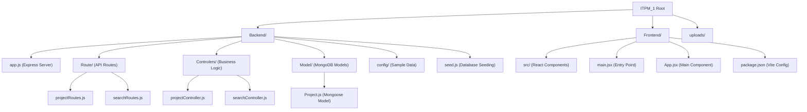

# Getting Started

<cite>
**Referenced Files in This Document**
- [package.json](file://Backend/package.json)
- [package.json](file://Frontend/package.json)
- [app.js](file://Backend/app.js)
- [main.jsx](file://Frontend/src/main.jsx)
- [App.jsx](file://Frontend/src/App.jsx)
- [projectRoutes.js](file://Backend/Route/projectRoutes.js)
- [searchRoutes.js](file://Backend/Route/searchRoutes.js)
- [projectController.js](file://Backend/Controlers/projectController.js)
- [searchController.js](file://Backend/Controlers/searchController.js)
- [Project.js](file://Backend/Model/Project.js)
- [projects.json](file://Backend/config/projects.json)
- [seed.js](file://Backend/seed.js)
</cite>

## Table of Contents
1. [Introduction](#introduction)
2. [Project Structure](#project-structure)
3. [Prerequisites](#prerequisites)
4. [Installation](#installation)
5. [Development Workflow](#development-workflow)
6. [Environment Configuration](#environment-configuration)
7. [Initial Project Setup](#initial-project-setup)
8. [What to Expect](#what-to-expect)
9. [API Endpoints](#api-endpoints)
10. [Troubleshooting](#troubleshooting)
11. [Next Steps](#next-steps)

## Introduction
This guide helps you set up and run the ITPM_1 full-stack project locally. The project consists of a modern MERN stack application with a React frontend and Express backend. It provides project management functionality with search, filtering, and CRUD operations. This comprehensive guide covers installing prerequisites, preparing both backend and frontend environments, running the development servers, and understanding the current console output and API responses.

## Project Structure
The ITPM_1 project follows a full-stack architecture with separate backend and frontend directories. The backend uses Express.js with MongoDB/Mongoose for data persistence, while the frontend uses React with Vite for fast development.



**Diagram sources**
- [app.js:1-84](file://Backend/app.js#L1-L84)
- [main.jsx:1-8](file://Frontend/src/main.jsx#L1-L8)
- [App.jsx:1-111](file://Frontend/src/App.jsx#L1-L111)
- [projectRoutes.js:1-47](file://Backend/Route/projectRoutes.js#L1-L47)
- [searchRoutes.js:1-23](file://Backend/Route/searchRoutes.js#L1-L23)
- [projectController.js:1-137](file://Backend/Controlers/projectController.js#L1-L137)
- [searchController.js:1-198](file://Backend/Controlers/searchController.js#L1-L198)
- [Project.js:1-56](file://Backend/Model/Project.js#L1-L56)

**Section sources**
- [app.js:1-84](file://Backend/app.js#L1-L84)
- [main.jsx:1-8](file://Frontend/src/main.jsx#L1-L8)
- [App.jsx:1-111](file://Frontend/src/App.jsx#L1-L111)

## Prerequisites
Before installing and running the project, ensure you have the following:

- **Node.js**: Version 16 or higher (check with `node --version`)
- **npm**: Latest version (check with `npm --version`)
- **MongoDB**: Local instance or MongoDB Atlas connection (optional for basic functionality)
- **Git**: For cloning the repository (if applicable)
- **Text Editor**: VS Code recommended with JavaScript/React extensions

**Section sources**
- [package.json:14-19](file://Backend/package.json#L14-L19)
- [package.json:10-16](file://Frontend/package.json#L10-L16)

## Installation
Follow these steps to install and prepare the complete ITPM_1 project:

### Backend Setup
1. Navigate to the Backend directory:
   ```bash
   cd Backend
   ```

2. Install backend dependencies:
   ```bash
   npm install
   ```

3. Verify installation by checking the node_modules folder contains:
   - express, mongoose, cors, nodemon
   - Dependencies are listed in [package.json:14-19](file://Backend/package.json#L14-L19)

### Frontend Setup
1. Navigate to the Frontend directory:
   ```bash
   cd ../Frontend
   ```

2. Install frontend dependencies:
   ```bash
   npm install
   ```

3. Verify installation by checking the node_modules folder contains:
   - react, react-dom, vite
   - Dependencies are listed in [package.json:10-16](file://Frontend/package.json#L10-L16)

### Database Setup (Optional but Recommended)
1. Install MongoDB locally or use MongoDB Atlas
2. Create a database named `itpm_project`
3. The application will automatically connect to `mongodb://localhost:27017/itpm_project` if no environment variable is set

**Section sources**
- [package.json:1-21](file://Backend/package.json#L1-L21)
- [package.json:1-18](file://Frontend/package.json#L1-L18)

## Development Workflow
The ITPM_1 project provides separate development workflows for backend and frontend:

### Backend Development
1. **Development with auto-reload**:
   ```bash
   npm run dev
   ```
   - Uses nodemon for automatic server restarts
   - Watches for file changes in the Backend directory
   - Runs on port 5000 by default

2. **Production-like run**:
   ```bash
   npm start
   ```
   - Starts server using Node.js directly
   - No auto-reload functionality

### Frontend Development
1. **Development server**:
   ```bash
   npm run dev
   ```
   - Uses Vite for fast development
   - Hot module replacement enabled
   - Runs on port 3000 by default

2. **Build for production**:
   ```bash
   npm run build
   ```
   - Creates optimized production bundle
   - Output in `dist/` directory

3. **Preview production build**:
   ```bash
   npm run preview
   ```
   - Serves the built application locally

### Complete Development Environment
For full development experience:
1. **Terminal 1**: Start backend
   ```bash
   cd Backend
   npm run dev
   ```

2. **Terminal 2**: Start frontend
   ```bash
   cd Frontend
   npm run dev
   ```

**Section sources**
- [package.json:6-11](file://Backend/package.json#L6-L11)
- [package.json:5-9](file://Frontend/package.json#L5-L9)

## Environment Configuration
Configure your development environment with these environment variables:

### Backend Environment Variables
Create a `.env` file in the Backend directory:

```env
NODE_ENV=development
PORT=5000
MONGODB_URI=mongodb://localhost:27017/itpm_project
```

### Frontend Environment Variables
Create a `.env` file in the Frontend directory:

```env
VITE_API_BASE_URL=http://localhost:5000/api
```

### Default Configuration
The application has sensible defaults:
- **Backend**: Port 5000, local MongoDB connection
- **Frontend**: Vite development server on port 3000
- **API Base URL**: `http://localhost:5000/api`

**Section sources**
- [app.js:10-18](file://Backend/app.js#L10-L18)
- [App.jsx:3](file://Frontend/src/App.jsx#L3)

## Initial Project Setup
Complete the initial setup to get the project running with sample data:

### Step 1: Start MongoDB
Ensure MongoDB is running locally or configure the connection string in the environment variable.

### Step 2: Seed the Database
Run the database seeding script to populate sample data:

```bash
cd Backend
node seed.js
```

This will:
- Connect to MongoDB
- Clear existing data
- Insert 10 sample projects
- Display success messages in the console

### Step 3: Start Both Servers
Open two terminals and start both servers:

**Terminal 1 (Backend)**:
```bash
cd Backend
npm run dev
```

**Terminal 2 (Frontend)**:
```bash
cd Frontend
npm run dev
```

### Step 4: Access the Application
- **Backend API**: [http://localhost:5000](http://localhost:5000)
- **Frontend**: [http://localhost:3000](http://localhost:3000)

**Section sources**
- [seed.js:101-133](file://Backend/seed.js#L101-L133)
- [app.js:73-81](file://Backend/app.js#L73-L81)

## What to Expect
During successful startup, you'll see different console outputs depending on the component:

### Backend Console Output
When the backend starts successfully:
```
🚀 Server running on http://localhost:5000
📚 API Documentation:
   GET  /api/projects           - Get all projects
   POST /api/projects           - Create new project
   GET  /api/projects/search    - Search & filter projects
   GET  /api/projects/filters   - Get filter options
   GET  /api/projects/suggestions?q=keyword - Search suggestions
```

### Frontend Console Output
When the frontend starts successfully:
```
VITE v5.x.x ready in X ms
  ➜ Local:   http://localhost:3000
  ➜ Network: http://192.168.x.x:3000
```

### Database Seeding Output
When running the seed script:
```
✅ Connected to MongoDB
🗑️  Cleared existing projects
✅ Created 10 sample projects
  1. AI-Powered Mobile Chatbot (AI)
  2. E-Commerce Web Platform (Web)
  ...
🎉 Database seeded successfully!
```

**Section sources**
- [app.js:73-81](file://Backend/app.js#L73-L81)
- [seed.js:104-125](file://Backend/seed.js#L104-L125)

## API Endpoints
The backend provides a comprehensive RESTful API for project management:

### Project Management Endpoints
- **GET** `/api/projects` - Get all projects
- **POST** `/api/projects` - Create new project
- **GET** `/api/projects/:id` - Get single project
- **PUT** `/api/projects/:id` - Update project
- **DELETE** `/api/projects/:id` - Delete project

### Search and Filter Endpoints
- **GET** `/api/projects/search` - Search & filter projects
  - Query parameters: `keyword`, `category`, `difficulty`, `department`, `status`, `sortBy`, `order`, `page`, `limit`
- **GET** `/api/projects/filters` - Get filter options
- **GET** `/api/projects/suggestions?q=keyword` - Get search suggestions

### Additional Endpoints
- **GET** `/api/search` - Alternative search endpoint
- **GET** `/api/search/filters` - Alternative filter options
- **GET** `/api/search/suggestions` - Alternative suggestions endpoint
- **GET** `/health` - Health check endpoint

### Response Format
All endpoints return JSON responses with consistent structure:
```json
{
  "success": true,
  "message": "Success message",
  "data": {},
  "count": 0,
  "pagination": {}
}
```

**Section sources**
- [projectRoutes.js:21-44](file://Backend/Route/projectRoutes.js#L21-L44)
- [searchRoutes.js:10-20](file://Backend/Route/searchRoutes.js#L10-L20)
- [app.js:27-52](file://Backend/app.js#L27-L52)

## Troubleshooting
Common issues and solutions:

### Node.js and npm Issues
- **Symptom**: `command not found` or version errors
- **Solution**: Install Node.js LTS version from [nodejs.org](https://nodejs.org/)

### Port Conflicts
- **Backend port 5000**: Change with `PORT=5001 npm run dev`
- **Frontend port 3000**: Change with `PORT=3001 npm run dev`
- **Check conflicts**: `lsof -i :5000` or `netstat -ano | findstr :5000`

### MongoDB Connection Issues
- **Local MongoDB not running**: Start MongoDB service or install MongoDB Community Edition
- **Connection string issues**: Set `MONGODB_URI` environment variable
- **Database permissions**: Ensure user has read/write permissions

### CORS Issues
- **Symptom**: Cross-origin request blocked
- **Solution**: CORS is enabled in the backend, but check browser console for specific errors

### Package Installation Issues
- **Network issues**: Use `npm install --registry https://registry.npmjs.org/`
- **Permission issues**: Use `sudo npm install` (macOS/Linux) or run as administrator (Windows)
- **Cache issues**: Clear npm cache with `npm cache clean --force`

### Frontend Build Issues
- **Missing dependencies**: Run `npm install` in Frontend directory
- **Vite configuration**: Check `vite.config.js` if custom configuration is needed
- **Hot reload issues**: Restart Vite development server

### API Response Issues
- **Empty results**: Check if database is seeded with `node seed.js`
- **404 errors**: Verify endpoint URLs match the routing structure
- **500 errors**: Check server console for detailed error messages

**Section sources**
- [app.js:17-25](file://Backend/app.js#L17-L25)
- [app.js:54-70](file://Backend/app.js#L54-L70)

## Next Steps
After completing the setup, consider these enhancements:

### Backend Enhancements
1. **Add Authentication**: Implement JWT-based authentication
2. **Add Validation**: Use Joi or express-validator for request validation
3. **Add Logging**: Implement Winston or Morgan for structured logging
4. **Add Testing**: Implement Jest and Supertest for API testing
5. **Add Documentation**: Generate API documentation with Swagger/OpenAPI

### Frontend Enhancements
1. **Add State Management**: Implement Redux Toolkit or Zustand
2. **Add Styling**: Use Tailwind CSS or styled-components
3. **Add Forms**: Implement form libraries like Formik or React Hook Form
4. **Add Testing**: Implement React Testing Library and Cypress
5. **Add Routing**: Implement React Router for navigation

### Project Features
1. **User Management**: Add user registration and authentication
2. **Project Comments**: Allow users to comment on projects
3. **Project Ratings**: Implement rating system for projects
4. **File Uploads**: Add image upload functionality for projects
5. **Real-time Updates**: Implement WebSocket for live updates

### Deployment
1. **Backend Deployment**: Deploy to platforms like Heroku, Vercel, or AWS
2. **Frontend Deployment**: Deploy static build to Netlify or Vercel
3. **Database Deployment**: Use MongoDB Atlas for production database
4. **CI/CD Pipeline**: Set up automated testing and deployment

### Monitoring and Maintenance
1. **Performance Monitoring**: Add performance monitoring tools
2. **Error Tracking**: Implement error tracking services
3. **Database Optimization**: Add indexes and optimize queries
4. **Security Updates**: Regularly update dependencies and security patches

This comprehensive guide provides everything needed to set up, run, and extend the ITPM_1 project successfully. The modular architecture makes it easy to add new features while maintaining clean separation between frontend and backend concerns.