# Implementation Roadmap

<cite>
**Referenced Files in This Document**
- [package.json](file://Backend/package.json)
- [package-lock.json](file://Backend/package-lock.json)
- [app.js](file://Backend/app.js)
</cite>

## Table of Contents
1. [Introduction](#introduction)
2. [Project Structure](#project-structure)
3. [Core Components](#core-components)
4. [Architecture Overview](#architecture-overview)
5. [Detailed Component Analysis](#detailed-component-analysis)
6. [Phase 1: Foundation](#phase-1-foundation)
7. [Phase 2: Core Features](#phase-2-core-features)
8. [Phase 3: Advanced Features](#phase-3-advanced-features)
9. [Timeline and Milestones](#timeline-and-milestones)
10. [Testing Strategies](#testing-strategies)
11. [Deployment Considerations](#deployment-considerations)
12. [Maintenance Planning](#maintenance-planning)
13. [Contributor Guidance](#contributor-guidance)
14. [Conclusion](#conclusion)

## Introduction

ITPM_1 is a Node.js backend application currently in its initial skeleton phase. The project utilizes Express.js for the web server framework and Mongoose for MongoDB database connectivity. This implementation roadmap outlines a structured approach to transform the current minimal setup into a fully functional application with three distinct phases of development.

The application follows a modular architecture pattern with separate directories for Controllers, Models, and Routes, establishing a foundation for clean separation of concerns. The current state provides the essential building blocks for a scalable backend system.

## Project Structure

The project follows a conventional Node.js backend structure with clear separation of concerns:

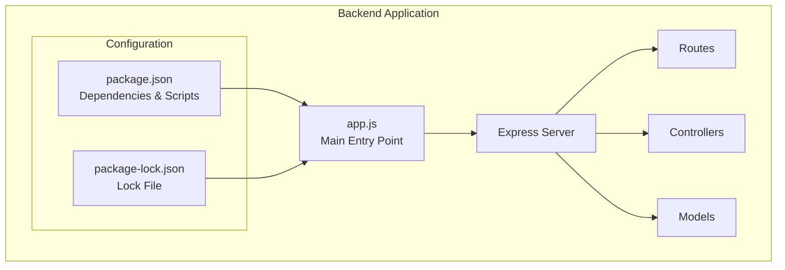
```mermaid
graph TB
subgraph "Backend Application"
A[app.js<br/>Main Entry Point] --> B[Express Server]
B --> C[Routes]
B --> D[Controllers]
B --> E[Models]
subgraph "Configuration"
F[package.json<br/>Dependencies & Scripts]
G[package-lock.json<br/>Lock File]
end
F --> A
G --> A
end
```

**Diagram sources**
- [app.js:1-1](file://Backend/app.js#L1-L1)
- [package.json:1-19](file://Backend/package.json#L1-L19)

The current structure includes:
- **app.js**: Minimal entry point with console logging
- **package.json**: Core dependencies including Express, Mongoose, and Nodemon
- **package-lock.json**: Dependency lock file for reproducible builds
- **Empty directories**: Controlers/, Model/, Route/ awaiting implementation

**Section sources**
- [app.js:1-1](file://Backend/app.js#L1-L1)
- [package.json:1-19](file://Backend/package.json#L1-L19)
- [package-lock.json:1-800](file://Backend/package-lock.json#L1-L800)

## Core Components

### Dependencies Analysis

The application relies on three primary dependencies:

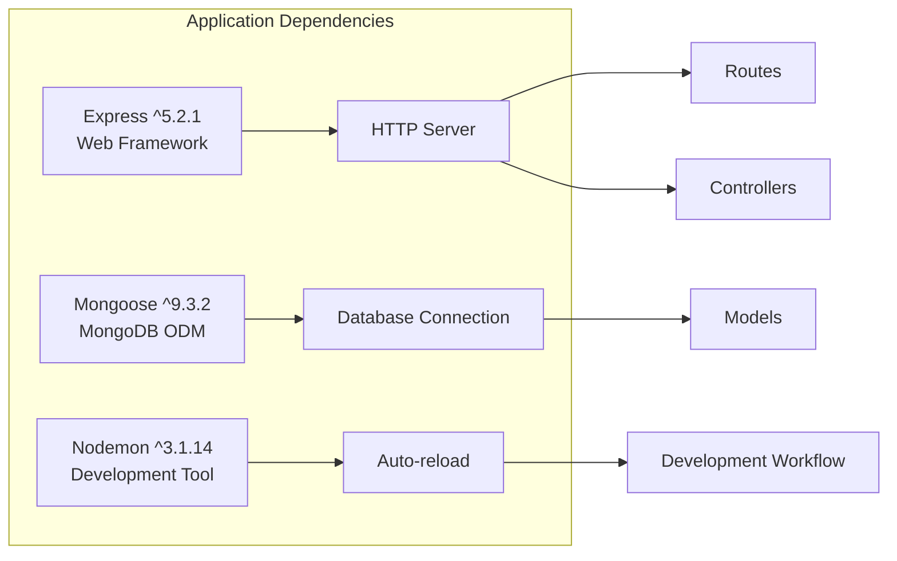
```mermaid
graph LR
subgraph "Application Dependencies"
A[Express ^5.2.1<br/>Web Framework] --> C[HTTP Server]
B[Mongoose ^9.3.2<br/>MongoDB ODM] --> D[Database Connection]
E[Nodemon ^3.1.14<br/>Development Tool] --> F[Auto-reload]
end
C --> G[Routes]
C --> H[Controllers]
D --> I[Models]
F --> J[Development Workflow]
```

**Diagram sources**
- [package.json:13-17](file://Backend/package.json#L13-L17)

### Current State Assessment

The application is currently in a minimal state with the following characteristics:
- Single-line console log in the main entry point
- Empty controller, model, and route directories
- Established dependency structure for production-ready development
- Clear architectural boundaries for future implementation

**Section sources**
- [package.json:13-17](file://Backend/package.json#L13-L17)

## Architecture Overview

The intended architecture follows the MVC (Model-View-Controller) pattern with clear separation of concerns:

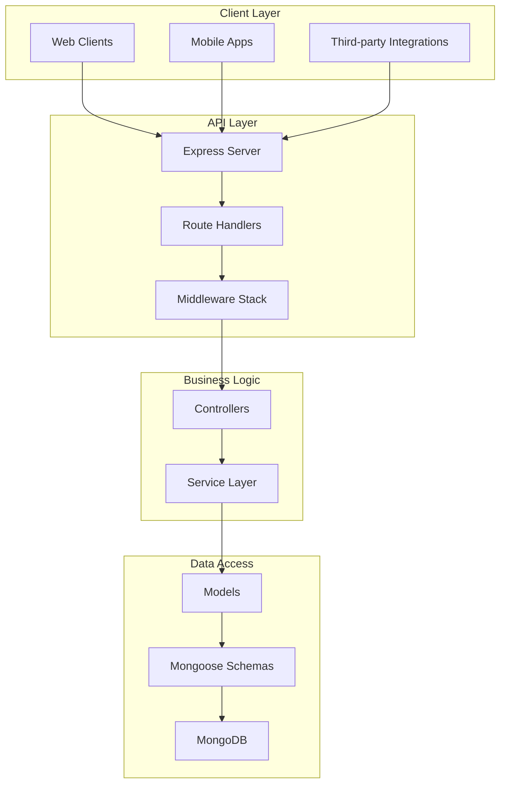
```mermaid
graph TB
subgraph "Client Layer"
A[Web Clients]
B[Mobile Apps]
C[Third-party Integrations]
end
subgraph "API Layer"
D[Express Server]
E[Route Handlers]
F[Middleware Stack]
end
subgraph "Business Logic"
G[Controllers]
H[Service Layer]
end
subgraph "Data Access"
I[Models]
J[Mongoose Schemas]
K[MongoDB]
end
A --> D
B --> D
C --> D
D --> E
E --> F
F --> G
G --> H
H --> I
I --> J
J --> K
```

**Diagram sources**
- [package.json:13-17](file://Backend/package.json#L13-L17)

The architecture emphasizes:
- **Separation of Concerns**: Clear boundaries between presentation, business logic, and data layers
- **Scalability**: Modular design allowing independent development and testing
- **Maintainability**: Standardized patterns for easy onboarding of new developers

## Detailed Component Analysis

### Express Server Configuration

The Express server serves as the central hub for all application functionality:

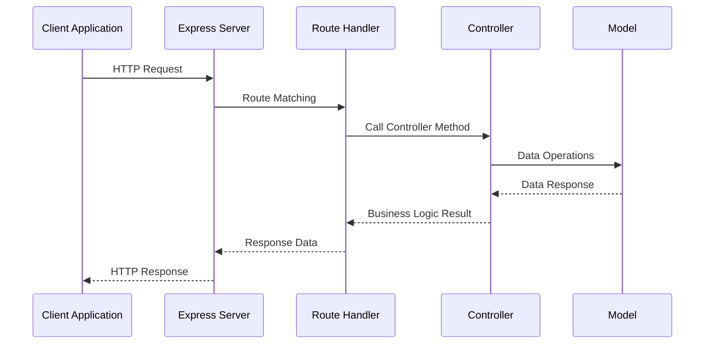
```mermaid
sequenceDiagram
participant Client as Client Application
participant Server as Express Server
participant Router as Route Handler
participant Controller as Controller
participant Model as Model
Client->>Server : HTTP Request
Server->>Router : Route Matching
Router->>Controller : Call Controller Method
Controller->>Model : Data Operations
Model-->>Controller : Data Response
Controller-->>Router : Business Logic Result
Router-->>Server : Response Data
Server-->>Client : HTTP Response
```

**Diagram sources**
- [package.json:13-17](file://Backend/package.json#L13-L17)

### Database Connection Strategy

Mongoose provides robust MongoDB connectivity with built-in error handling:

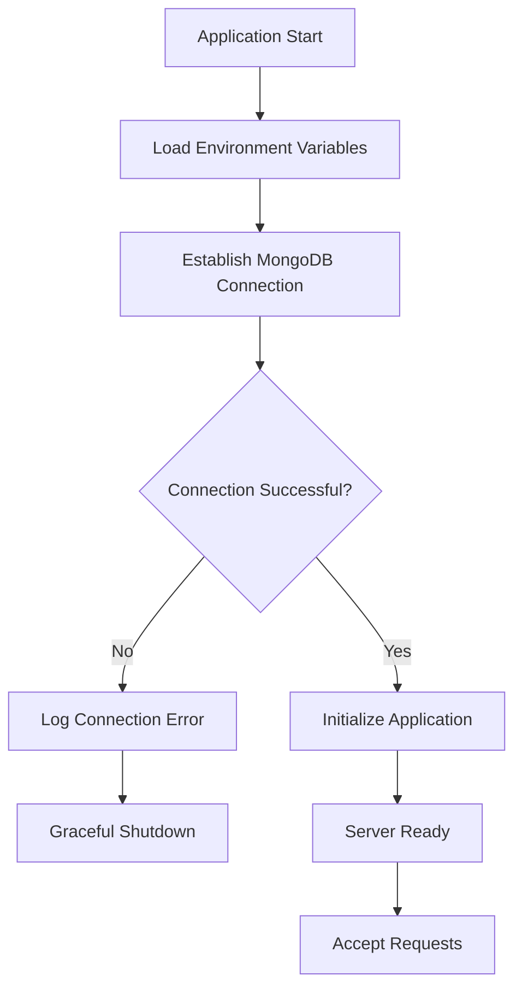
```mermaid
flowchart TD
A[Application Start] --> B[Load Environment Variables]
B --> C[Establish MongoDB Connection]
C --> D{Connection Successful?}
D --> |Yes| E[Initialize Application]
D --> |No| F[Log Connection Error]
F --> G[Graceful Shutdown]
E --> H[Server Ready]
H --> I[Accept Requests]
```

**Diagram sources**
- [package.json:15-15](file://Backend/package.json#L15-L15)

**Section sources**
- [package.json:13-17](file://Backend/package.json#L13-L17)

## Phase 1: Foundation

### Phase Objective
Establish the fundamental infrastructure for a production-ready backend application.

### Timeline Estimate
**Weeks 1-2**: Foundation establishment

### Milestone Markers
- ✅ Express server initialization
- ✅ MongoDB connection established
- ✅ Basic error handling implementation
- ✅ Environment configuration setup
- ✅ Logging system implementation

### Core Implementation Tasks

#### 1. Server Setup and Configuration

The Express server requires comprehensive initialization:

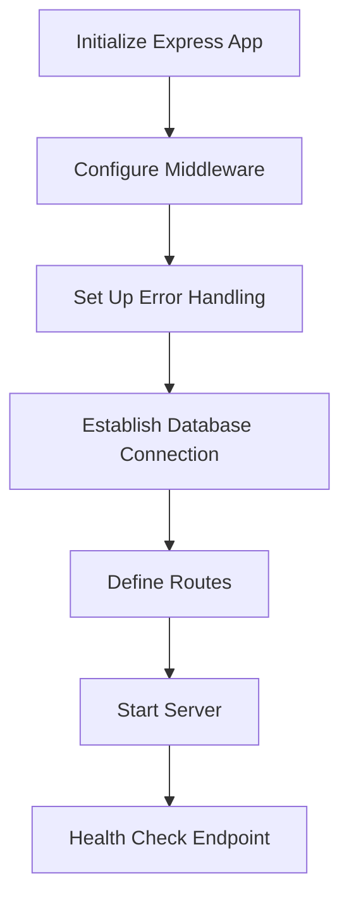
```mermaid
flowchart TD
A[Initialize Express App] --> B[Configure Middleware]
B --> C[Set Up Error Handling]
C --> D[Establish Database Connection]
D --> E[Define Routes]
E --> F[Start Server]
F --> G[Health Check Endpoint]
```

**Diagram sources**
- [package.json:13-17](file://Backend/package.json#L13-L17)

#### 2. Database Connection Management

Implement robust database connectivity with connection pooling and error handling:

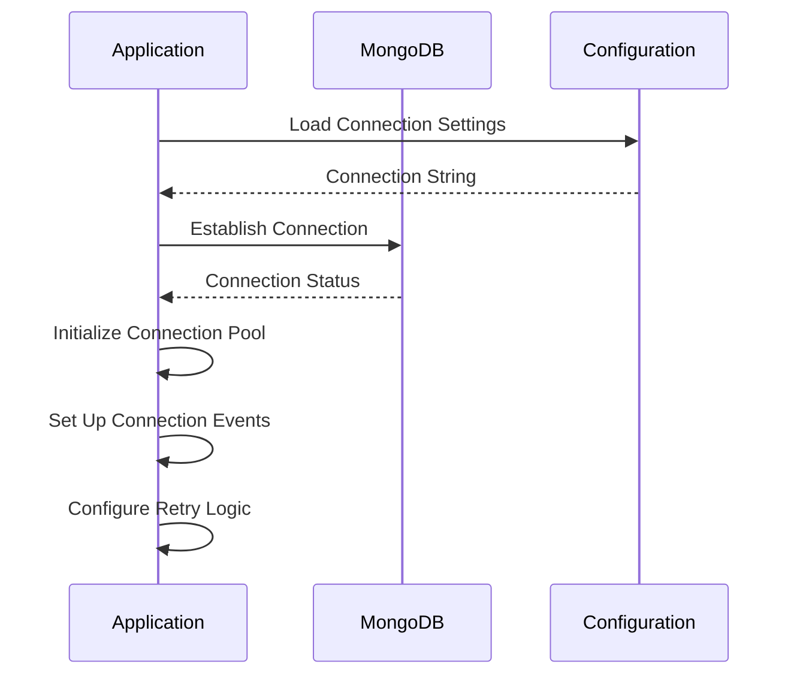
```mermaid
sequenceDiagram
participant App as Application
participant DB as MongoDB
participant Config as Configuration
App->>Config : Load Connection Settings
Config-->>App : Connection String
App->>DB : Establish Connection
DB-->>App : Connection Status
App->>App : Initialize Connection Pool
App->>App : Set Up Connection Events
App->>App : Configure Retry Logic
```

**Diagram sources**
- [package.json:15-15](file://Backend/package.json#L15-L15)

#### 3. Basic Error Handling Framework

Implement comprehensive error handling across all application layers:

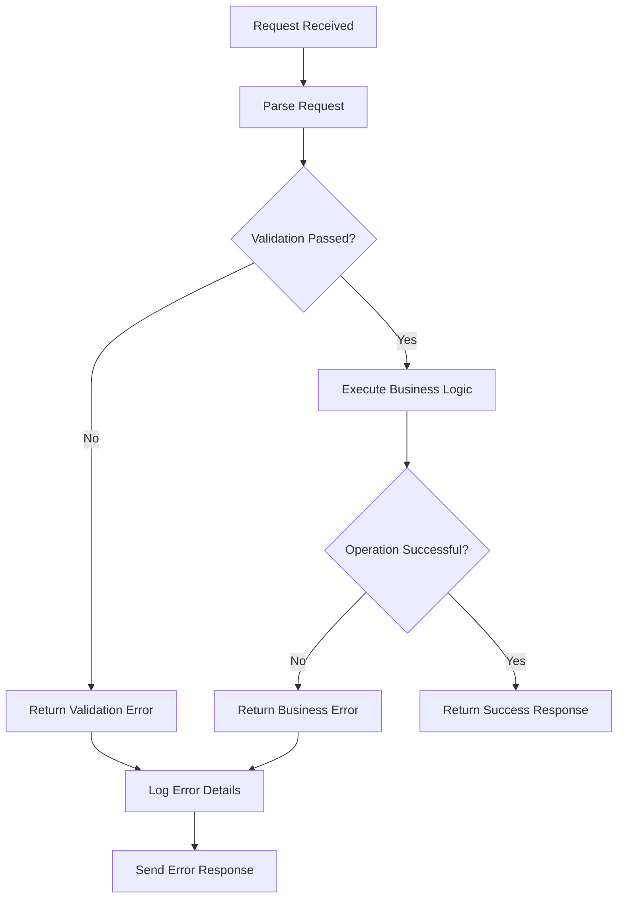
```mermaid
flowchart TD
A[Request Received] --> B[Parse Request]
B --> C{Validation Passed?}
C --> |No| D[Return Validation Error]
C --> |Yes| E[Execute Business Logic]
E --> F{Operation Successful?}
F --> |No| G[Return Business Error]
F --> |Yes| H[Return Success Response]
D --> I[Log Error Details]
G --> I
I --> J[Send Error Response]
```

**Diagram sources**
- [package.json:13-17](file://Backend/package.json#L13-L17)

### Dependency Relationships

Phase 1 establishes critical dependencies:
- Express server depends on Mongoose for database operations
- Error handling framework supports all subsequent phases
- Environment configuration enables deployment flexibility
- Logging system provides operational visibility

**Section sources**
- [package.json:13-17](file://Backend/package.json#L13-L17)

## Phase 2: Core Features

### Phase Objective
Implement essential CRUD operations, authentication system, and API endpoints.

### Timeline Estimate
**Weeks 3-6**: Feature implementation

### Milestone Markers
- ✅ Complete CRUD operations for primary resources
- ✅ Authentication and authorization system
- ✅ Comprehensive API endpoint implementation
- ✅ Input validation and sanitization
- ✅ Response formatting standards

### Core Implementation Tasks

#### 1. CRUD Operations Implementation

Develop standardized CRUD operations with consistent patterns:

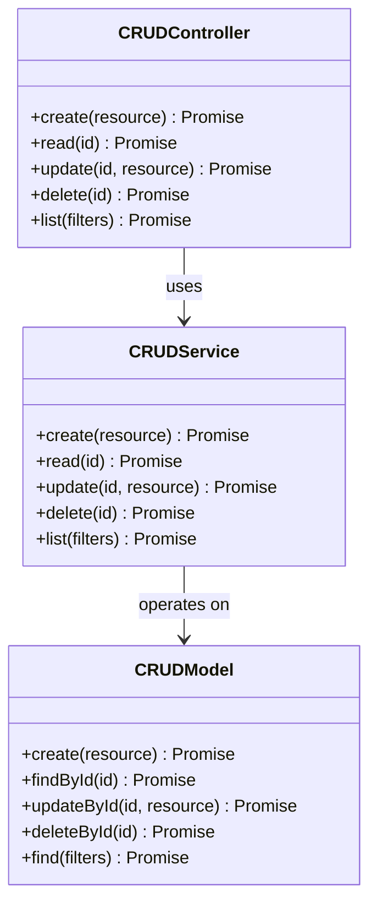
```mermaid
classDiagram
class CRUDController {
+create(resource) Promise
+read(id) Promise
+update(id, resource) Promise
+delete(id) Promise
+list(filters) Promise
}
class CRUDService {
+create(resource) Promise
+read(id) Promise
+update(id, resource) Promise
+delete(id) Promise
+list(filters) Promise
}
class CRUDModel {
+create(resource) Promise
+findById(id) Promise
+updateById(id, resource) Promise
+deleteById(id) Promise
+find(filters) Promise
}
CRUDController --> CRUDService : uses
CRUDService --> CRUDModel : operates on
```

**Diagram sources**
- [package.json:13-17](file://Backend/package.json#L13-L17)

#### 2. Authentication System

Implement secure authentication with JWT tokens and role-based access control:

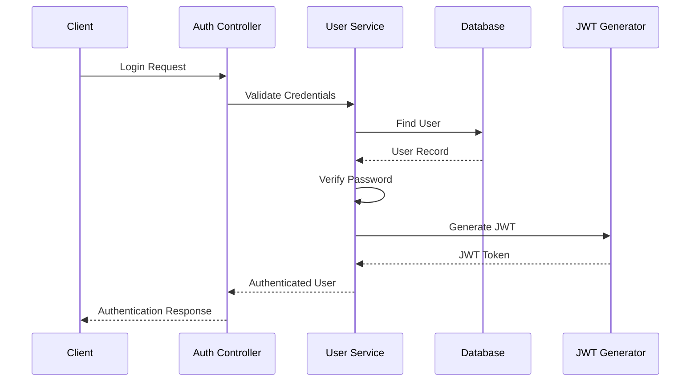
```mermaid
sequenceDiagram
participant Client as Client
participant Auth as Auth Controller
participant User as User Service
participant DB as Database
participant Token as JWT Generator
Client->>Auth : Login Request
Auth->>User : Validate Credentials
User->>DB : Find User
DB-->>User : User Record
User->>User : Verify Password
User->>Token : Generate JWT
Token-->>User : JWT Token
User-->>Auth : Authenticated User
Auth-->>Client : Authentication Response
```

**Diagram sources**
- [package.json:13-17](file://Backend/package.json#L13-L17)

#### 3. API Endpoint Implementation

Standardize API endpoints with consistent patterns and response formats:

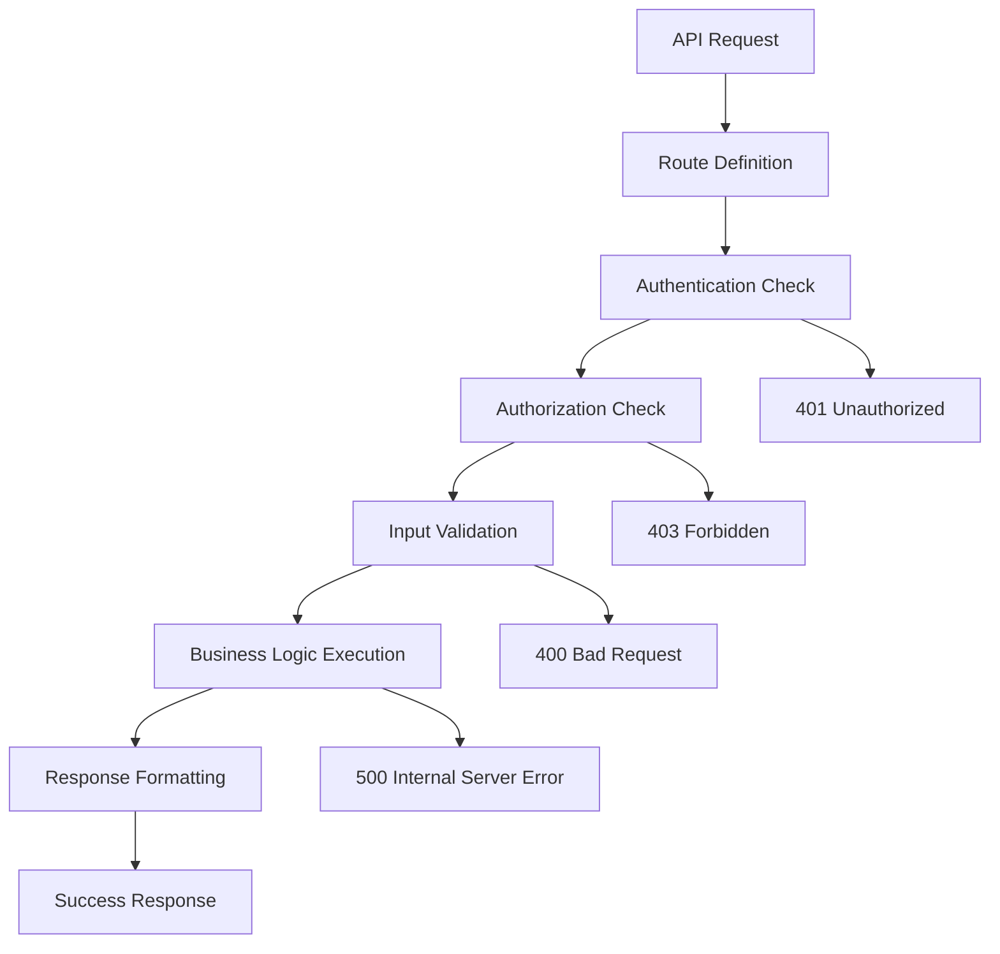
```mermaid
flowchart TD
A[API Request] --> B[Route Definition]
B --> C[Authentication Check]
C --> D[Authorization Check]
D --> E[Input Validation]
E --> F[Business Logic Execution]
F --> G[Response Formatting]
G --> H[Success Response]
C --> I[401 Unauthorized]
D --> J[403 Forbidden]
E --> K[400 Bad Request]
F --> L[500 Internal Server Error]
```

**Diagram sources**
- [package.json:13-17](file://Backend/package.json#L13-L17)

### Dependency Relationships

Phase 2 builds upon Phase 1 foundations:
- CRUD operations depend on established database connections
- Authentication system requires secure token generation
- API endpoints utilize standardized error handling
- Input validation ensures data integrity

**Section sources**
- [package.json:13-17](file://Backend/package.json#L13-L17)

## Phase 3: Advanced Features

### Phase Objective
Implement middleware systems, comprehensive testing framework, and automated documentation.

### Timeline Estimate
**Weeks 7-8**: Advanced feature implementation

### Milestone Markers
- ✅ Middleware pipeline implementation
- ✅ Comprehensive testing suite
- ✅ Automated documentation generation
- ✅ Performance monitoring
- ✅ Security enhancements

### Core Implementation Tasks

#### 1. Middleware Implementation

Develop a flexible middleware system for cross-cutting concerns:

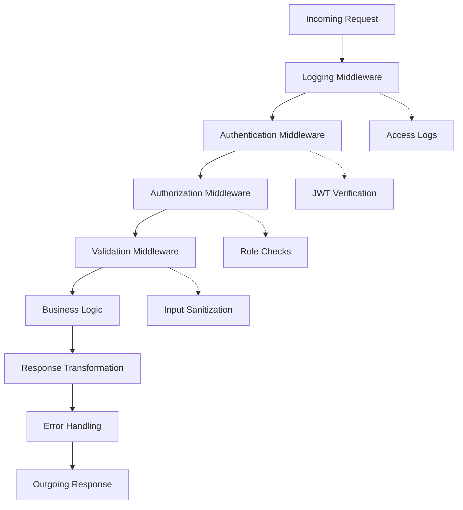
```mermaid
flowchart TD
A[Incoming Request] --> B[Logging Middleware]
B --> C[Authentication Middleware]
C --> D[Authorization Middleware]
D --> E[Validation Middleware]
E --> F[Business Logic]
F --> G[Response Transformation]
G --> H[Error Handling]
H --> I[Outgoing Response]
B -.-> J[Access Logs]
C -.-> K[JWT Verification]
D -.-> L[Role Checks]
E -.-> M[Input Sanitization]
```

**Diagram sources**
- [package.json:13-17](file://Backend/package.json#L13-L17)

#### 2. Testing Framework

Implement comprehensive testing covering all application layers:

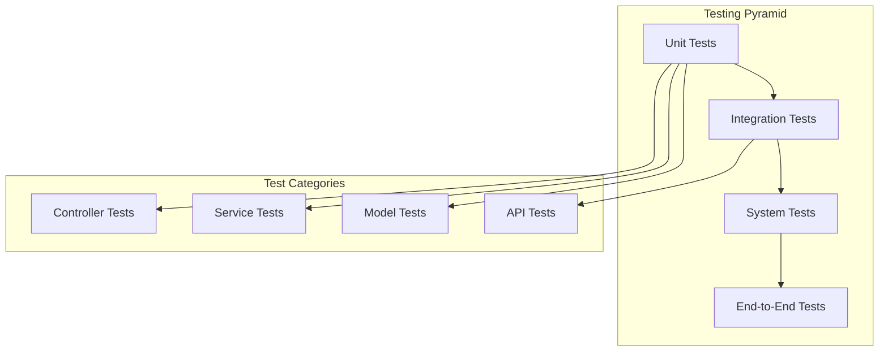
```mermaid
graph TB
subgraph "Testing Pyramid"
A[Unit Tests] --> B[Integration Tests]
B --> C[System Tests]
C --> D[End-to-End Tests]
end
subgraph "Test Categories"
E[Controller Tests]
F[Service Tests]
G[Model Tests]
H[API Tests]
end
A --> E
A --> F
A --> G
B --> H
```

**Diagram sources**
- [package.json:8-8](file://Backend/package.json#L8-L8)

#### 3. Documentation Generation

Automate documentation creation for API endpoints and system architecture:

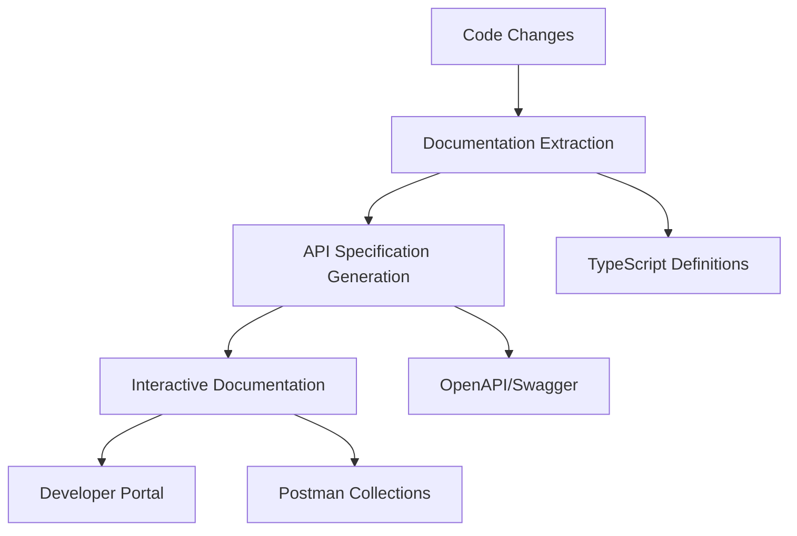
```mermaid
flowchart TD
A[Code Changes] --> B[Documentation Extraction]
B --> C[API Specification Generation]
C --> D[Interactive Documentation]
D --> E[Developer Portal]
B --> F[TypeScript Definitions]
C --> G[OpenAPI/Swagger]
D --> H[Postman Collections]
```

**Diagram sources**
- [package.json:13-17](file://Backend/package.json#L13-L17)

### Dependency Relationships

Phase 3 enhances previous phases:
- Middleware system integrates with existing authentication
- Testing framework validates all implemented features
- Documentation reflects complete system functionality
- Performance monitoring tracks system health

**Section sources**
- [package.json:8-8](file://Backend/package.json#L8-L8)
- [package.json:13-17](file://Backend/package.json#L13-L17)

## Timeline and Milestones

### Development Timeline

```mermaid
gantt
title ITPM_1 Implementation Timeline
dateFormat X
axisFormat %W
section Foundation Phase
Server Setup :done, 1, 2
Database Connection :done, 1, 2
Error Handling :done, 1, 2
section Core Features Phase
CRUD Operations :active, 3, 4
Authentication System :active, 3, 5
API Endpoints :active, 4, 3
section Advanced Features Phase
Middleware System :active, 7, 2
Testing Framework :active, 7, 2
Documentation :active, 8, 1
```

### Milestone Progression

| Phase | Duration | Key Deliverables | Dependencies |
|-------|----------|------------------|--------------|
| **Foundation** | Weeks 1-2 | Express server, database connection, error handling | None |
| **Core Features** | Weeks 3-6 | CRUD operations, authentication, API endpoints | Foundation |
| **Advanced Features** | Weeks 7-8 | Middleware, testing, documentation | Core Features |

### Risk Mitigation

- **Technical Debt**: Regular refactoring during each phase
- **Integration Issues**: Comprehensive testing between phases
- **Performance Bottlenecks**: Monitoring and optimization throughout
- **Security Vulnerabilities**: Security reviews at each milestone

## Testing Strategies

### Test Implementation Approach

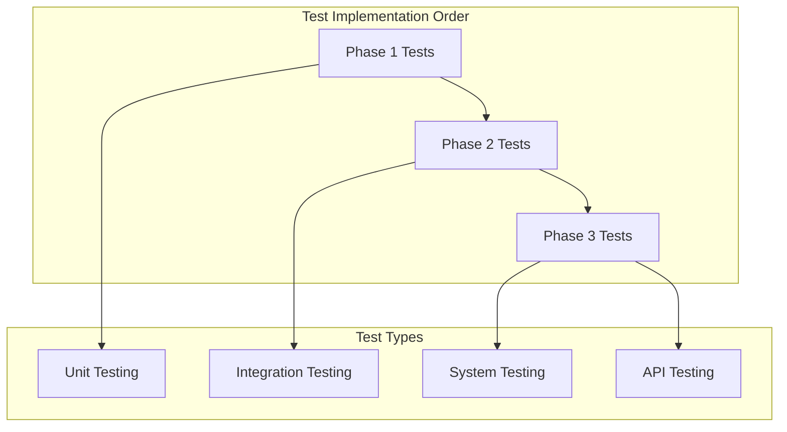
```mermaid
graph TB
subgraph "Test Implementation Order"
A[Phase 1 Tests] --> B[Phase 2 Tests]
B --> C[Phase 3 Tests]
end
subgraph "Test Types"
D[Unit Testing]
E[Integration Testing]
F[System Testing]
G[API Testing]
end
A --> D
B --> E
C --> F
C --> G
```

### Testing Infrastructure

The testing strategy follows a layered approach:

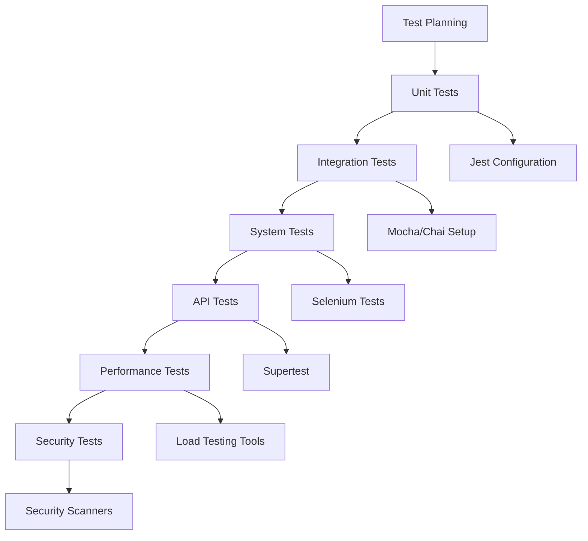
```mermaid
flowchart TD
A[Test Planning] --> B[Unit Tests]
B --> C[Integration Tests]
C --> D[System Tests]
D --> E[API Tests]
E --> F[Performance Tests]
F --> G[Security Tests]
B --> H[Jest Configuration]
C --> I[Mocha/Chai Setup]
D --> J[Selenium Tests]
E --> K[Supertest]
F --> L[Load Testing Tools]
G --> M[Security Scanners]
```

### Quality Assurance Metrics

- **Code Coverage**: Target 80%+ across all phases
- **Test Execution Time**: Optimize for rapid feedback loops
- **Bug Detection Rate**: Early identification and resolution
- **Performance Benchmarks**: Monitor under load conditions

**Section sources**
- [package.json:8-8](file://Backend/package.json#L8-L8)

## Deployment Considerations

### Production Readiness Checklist

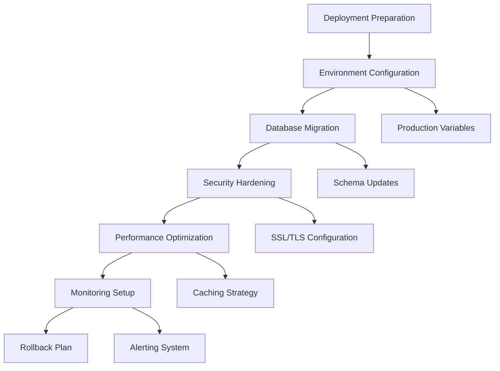
```mermaid
flowchart TD
A[Deployment Preparation] --> B[Environment Configuration]
B --> C[Database Migration]
C --> D[Security Hardening]
D --> E[Performance Optimization]
E --> F[Monitoring Setup]
F --> G[Rollback Plan]
B --> H[Production Variables]
C --> I[Schema Updates]
D --> J[SSL/TLS Configuration]
E --> K[Caching Strategy]
F --> L[Alerting System]
```

### Deployment Architecture

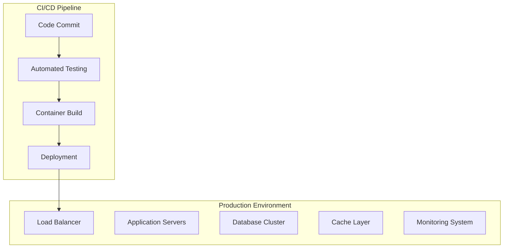
```mermaid
graph TB
subgraph "Production Environment"
A[Load Balancer]
B[Application Servers]
C[Database Cluster]
D[Cache Layer]
E[Monitoring System]
end
subgraph "CI/CD Pipeline"
F[Code Commit]
G[Automated Testing]
H[Container Build]
I[Deployment]
end
F --> G
G --> H
H --> I
I --> A
```

### Operational Excellence

- **Health Checks**: Automated monitoring of service availability
- **Logging**: Centralized logging for debugging and auditing
- **Backup Strategy**: Regular database backups and recovery procedures
- **Scaling**: Horizontal scaling capabilities for increased demand
- **Security**: Regular security updates and vulnerability assessments

## Maintenance Planning

### Long-term Sustainability

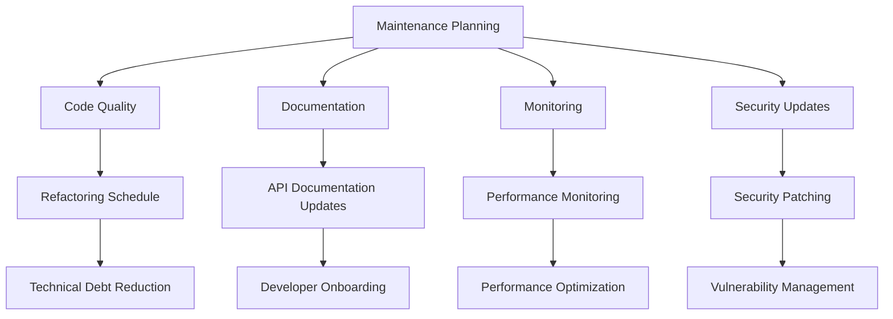
```mermaid
flowchart TD
A[Maintenance Planning] --> B[Code Quality]
A --> C[Documentation]
A --> D[Monitoring]
A --> E[Security Updates]
B --> F[Refactoring Schedule]
C --> G[API Documentation Updates]
D --> H[Performance Monitoring]
E --> I[Security Patching]
F --> J[Technical Debt Reduction]
G --> K[Developer Onboarding]
H --> L[Performance Optimization]
I --> M[Vulnerability Management]
```

### Evolution Strategy

The application should evolve through continuous improvement cycles:

1. **Quarterly Reviews**: Assess technology stack and update dependencies
2. **Feature Roadmaps**: Plan incremental improvements based on user feedback
3. **Performance Audits**: Regular optimization of database queries and API responses
4. **Security Audits**: Periodic security assessments and penetration testing
5. **Developer Experience**: Continuous improvement of development workflow and tooling

### Knowledge Transfer

- **Documentation Standards**: Maintain up-to-date technical documentation
- **Code Examples**: Provide clear examples for common implementation patterns
- **Best Practices**: Establish coding standards and architectural guidelines
- **Onboarding Materials**: Create comprehensive guides for new team members

## Contributor Guidance

### Getting Started Guide

```mermaid
flowchart TD
A[New Contributor] --> B[Environment Setup]
B --> C[Code Review Process]
C --> D[Development Workflow]
D --> E[Testing Requirements]
E --> F[Deployment Process]
B --> G[Local Development]
C --> H[Pull Request Guidelines]
D --> I[Branch Naming Convention]
E --> J[Commit Message Standards]
F --> K[Release Process]
```

### Development Guidelines

#### Code Organization
- Follow the established MVC pattern with clear separation of concerns
- Implement consistent naming conventions across all layers
- Maintain modular architecture for easy testing and maintenance
- Document public APIs with clear interface definitions

#### Contribution Workflow
1. Fork the repository and create feature branches
2. Implement changes following established patterns
3. Write comprehensive tests for new functionality
4. Update documentation for API changes
5. Submit pull requests with clear descriptions
6. Participate in code review process

#### Best Practices
- **Error Handling**: Implement comprehensive error handling at all levels
- **Security**: Follow security best practices for authentication and data protection
- **Performance**: Optimize database queries and API responses
- **Testing**: Maintain high test coverage and quality standards
- **Documentation**: Keep documentation current with code changes

### Integration Points

Contributors should understand how features integrate with the overall architecture:

```mermaid
sequenceDiagram
participant Dev as Developer
participant Controller as Controller
participant Service as Service Layer
participant Model as Data Model
participant DB as Database
Dev->>Controller : Implement Feature
Controller->>Service : Business Logic
Service->>Model : Data Operations
Model->>DB : Database Queries
DB-->>Model : Query Results
Model-->>Service : Data Objects
Service-->>Controller : Business Results
Controller-->>Dev : API Response
```

## Conclusion

The ITPM_1 implementation roadmap provides a structured approach to transforming the current skeleton application into a production-ready backend system. The phased development approach ensures steady progress while maintaining code quality and architectural integrity.

Key success factors for this implementation include:

- **Foundation First**: Establishing robust infrastructure before feature development
- **Incremental Delivery**: Releasing value in manageable increments
- **Quality Focus**: Maintaining high standards throughout all phases
- **Team Collaboration**: Clear guidelines and processes for contributor onboarding
- **Future Planning**: Architectural decisions that support long-term growth

The three-phase approach balances rapid progress with careful planning, ensuring that each milestone builds upon previous achievements while preparing the foundation for advanced features. This strategy maximizes the likelihood of successful delivery while minimizing technical debt and development risks.

Regular assessment and adaptation of the roadmap will be essential as requirements evolve and new challenges arise during implementation. The documented approach provides a solid foundation for achieving the project's objectives within the planned timeline.