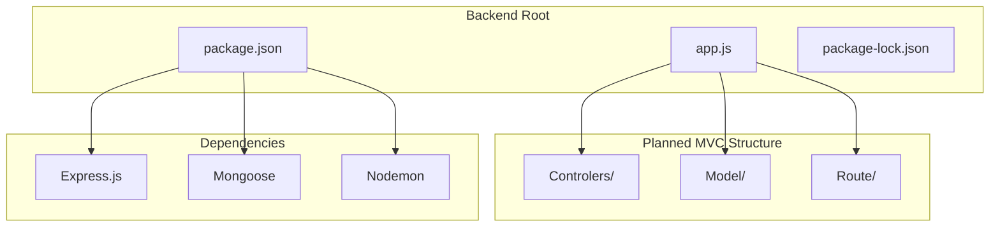
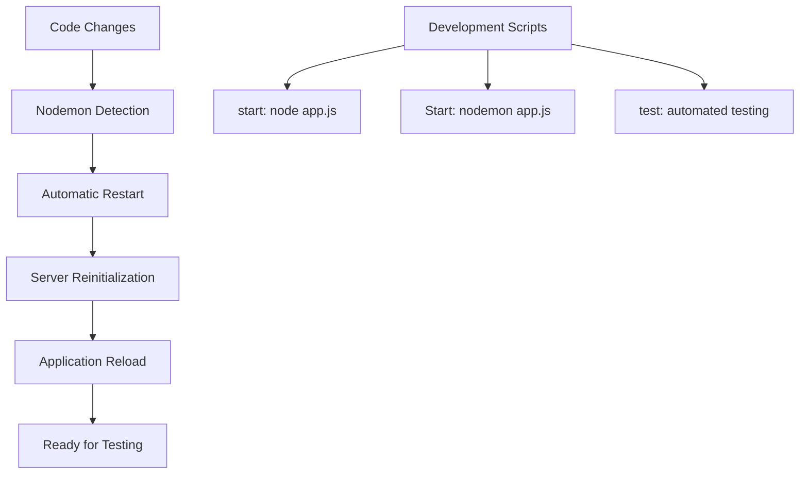
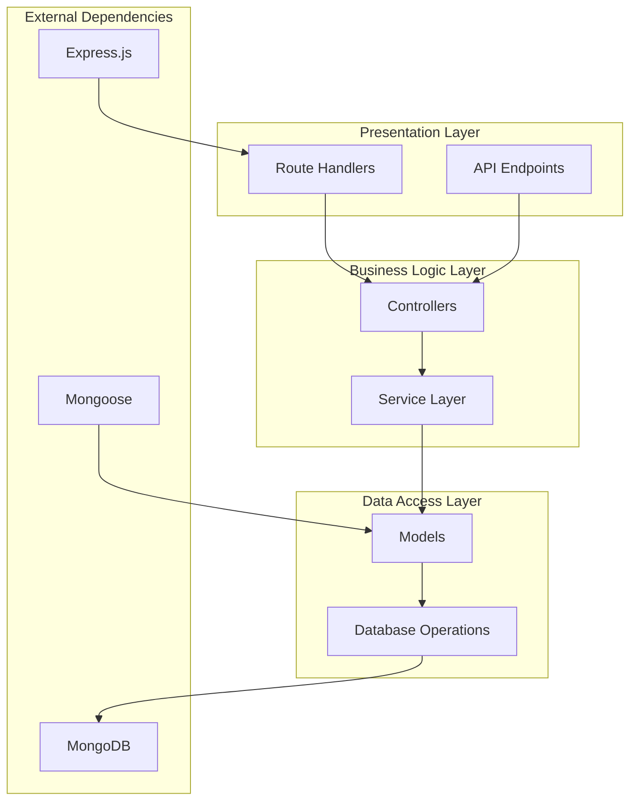
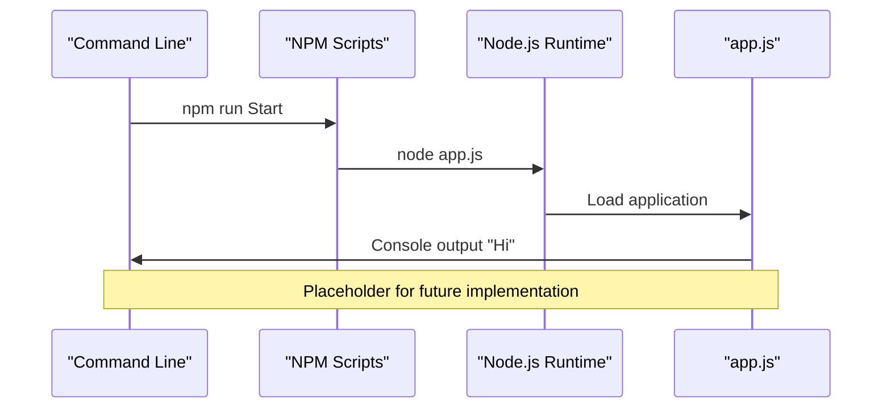
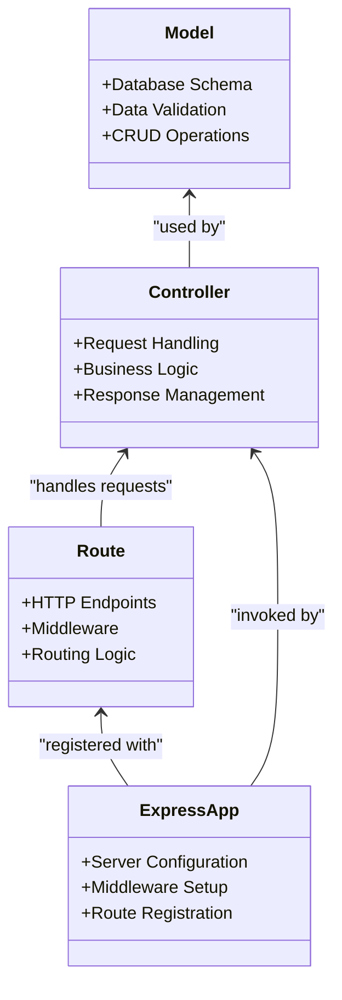
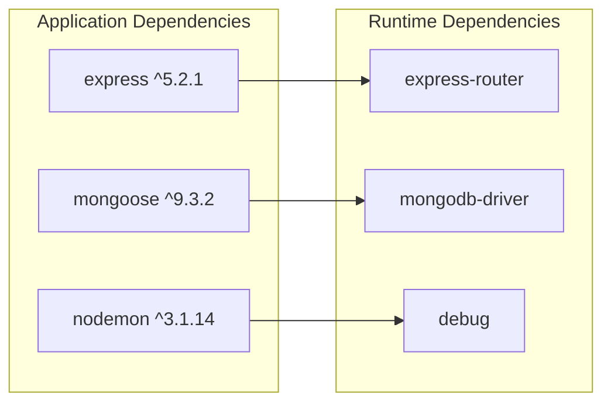

# Project Overview

<cite>
**Referenced Files in This Document**
- [package.json](file://Backend/package.json)
- [package-lock.json](file://Backend/package-lock.json)
- [app.js](file://Backend/app.js)
</cite>

## Table of Contents
1. [Introduction](#introduction)
2. [Project Structure](#project-structure)
3. [Core Components](#core-components)
4. [Architecture Overview](#architecture-overview)
5. [Detailed Component Analysis](#detailed-component-analysis)
6. [Dependency Analysis](#dependency-analysis)
7. [Performance Considerations](#performance-considerations)
8. [Troubleshooting Guide](#troubleshooting-guide)
9. [Conclusion](#conclusion)

## Introduction
ITPM_1 is a Node.js backend application designed to serve as a foundational platform for building scalable server-side functionality. The project currently exists in an early development stage with a clear foundation established for future growth. Its primary purpose is to provide a structured backend environment using modern web technologies, enabling rapid development of RESTful APIs and database-driven applications.

The project targets diverse use cases including but not limited to:
- Building RESTful APIs for web and mobile applications
- Creating database-driven web applications with MongoDB integration
- Developing microservice architectures with modular routing
- Establishing scalable backend infrastructure for enterprise solutions

## Project Structure
The project follows a conventional Node.js backend structure with planned MVC (Model-View-Controller) architecture. The current directory layout reflects the intended separation of concerns:

**Diagram sources**
- [package.json:1-19](file://Backend/package.json#L1-L19)
- [app.js:1-1](file://Backend/app.js#L1-L1)

The structure demonstrates a clear separation of concerns with separate directories for controllers, models, and routes, indicating the project's commitment to maintaining clean architectural boundaries.

**Section sources**
- [package.json:1-19](file://Backend/package.json#L1-L19)
- [app.js:1-1](file://Backend/app.js#L1-L1)

## Core Components
The project's core components establish the foundation for a robust backend architecture:

### Technology Stack
The application leverages a modern technology stack optimized for Node.js development:

- **Express.js (^5.2.1)**: Web application framework providing HTTP server capabilities, middleware support, and routing functionality
- **MongoDB with Mongoose (^9.3.2)**: Database connectivity layer offering ODM (Object Data Modeling) capabilities for MongoDB operations
- **Nodemon (^3.1.14)**: Development tool for automatic server restarts during code changes

### Development Workflow
The project implements a streamlined development workflow:

**Diagram sources**
- [package.json:6-10](file://Backend/package.json#L6-L10)

**Section sources**
- [package.json:13-17](file://Backend/package.json#L13-L17)
- [package.json:6-10](file://Backend/package.json#L6-L10)

## Architecture Overview
The project is designed around a layered architecture that promotes maintainability and scalability:

This architecture ensures clear separation between presentation, business logic, and data access layers, facilitating easier maintenance and testing.

## Detailed Component Analysis

### Current Application Entry Point
The current application entry point serves as a placeholder for future development:

**Diagram sources**
- [app.js:1-1](file://Backend/app.js#L1-L1)
- [package.json:9](file://Backend/package.json#L9)

### Planned MVC Implementation
The project structure indicates a comprehensive MVC architecture:

**Diagram sources**
- [package.json:1-19](file://Backend/package.json#L1-L19)

**Section sources**
- [package.json:1-19](file://Backend/package.json#L1-L19)

## Dependency Analysis
The project's dependency graph reveals a focused set of core libraries:

**Diagram sources**
- [package.json:13-17](file://Backend/package.json#L13-L17)
- [package-lock.json:1-200](file://Backend/package-lock.json#L1-L200)

The dependency analysis shows:
- **Express.js**: Provides the web framework foundation with router capabilities
- **Mongoose**: Offers MongoDB ODM functionality with schema validation
- **Nodemon**: Enables hot reloading during development

**Section sources**
- [package.json:13-17](file://Backend/package.json#L13-L17)
- [package-lock.json:1-200](file://Backend/package-lock.json#L1-L200)

## Performance Considerations
The project's current stage presents several performance considerations:

### Development Phase Optimizations
- **Hot Reloading**: Nodemon enables rapid development cycles without manual server restarts
- **Minimal Dependencies**: Current dependency set keeps startup overhead low
- **Modular Structure**: MVC separation allows for targeted optimization of specific components

### Scalability Planning
The architecture supports future scaling through:
- **Database Indexing**: Mongoose schema design allows for efficient query optimization
- **Connection Pooling**: MongoDB driver integration supports connection pooling
- **Middleware Architecture**: Express middleware enables request/response optimization

## Troubleshooting Guide
Common issues and resolutions for the current development stage:

### Development Environment Issues
- **Port Conflicts**: Ensure port availability when running the server
- **Dependency Installation**: Run `npm install` to resolve missing dependencies
- **File Watching**: Verify Nodemon is properly monitoring file changes

### Application Startup Problems
- **Entry Point Issues**: Confirm app.js contains valid initialization code
- **Module Resolution**: Check that all required modules are properly installed
- **Environment Variables**: Ensure database connection strings are configured

**Section sources**
- [package.json:6-10](file://Backend/package.json#L6-L10)

## Conclusion
ITPM_1 represents a well-structured foundation for a Node.js backend application with clear architectural intentions. The project demonstrates maturity in its technology choices, with Express.js providing a robust web framework, Mongoose offering comprehensive MongoDB integration, and Nodemon enabling efficient development workflows.

The current placeholder state indicates the project is ready for immediate development with the MVC structure already established. The planned architecture positions the application for scalable growth while maintaining code organization and maintainability.

Future development should focus on implementing the controller, model, and route components according to the established structure, ensuring each layer maintains its separation of concerns while building toward a production-ready application.